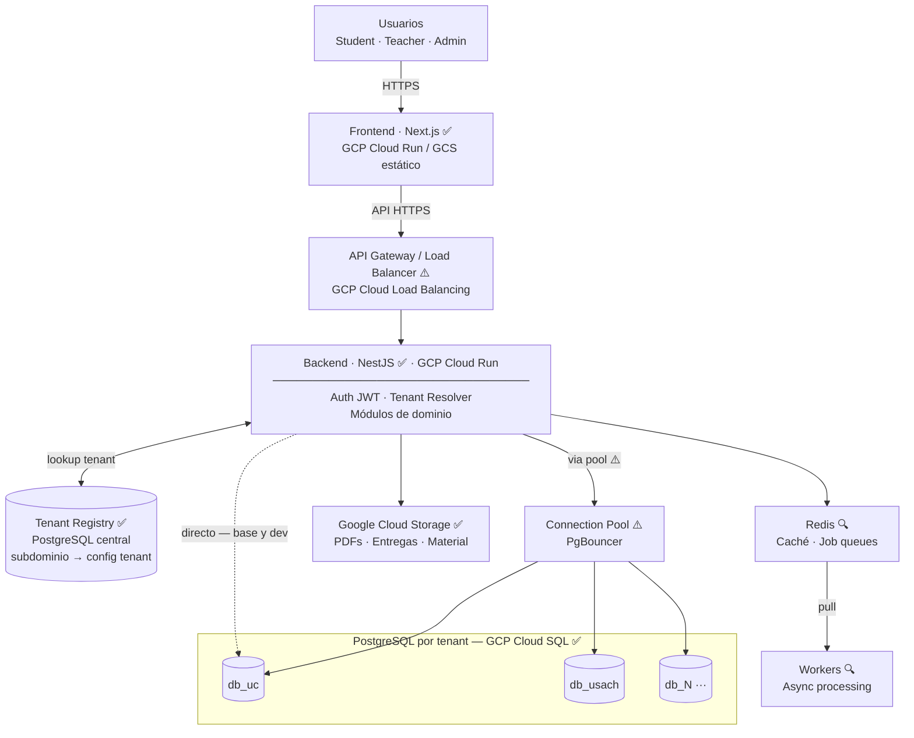
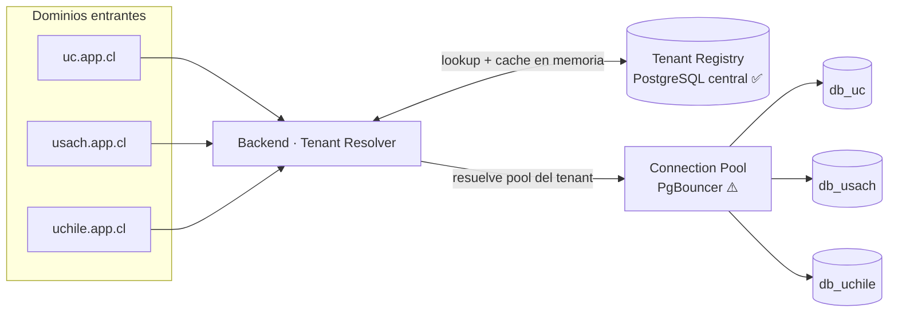
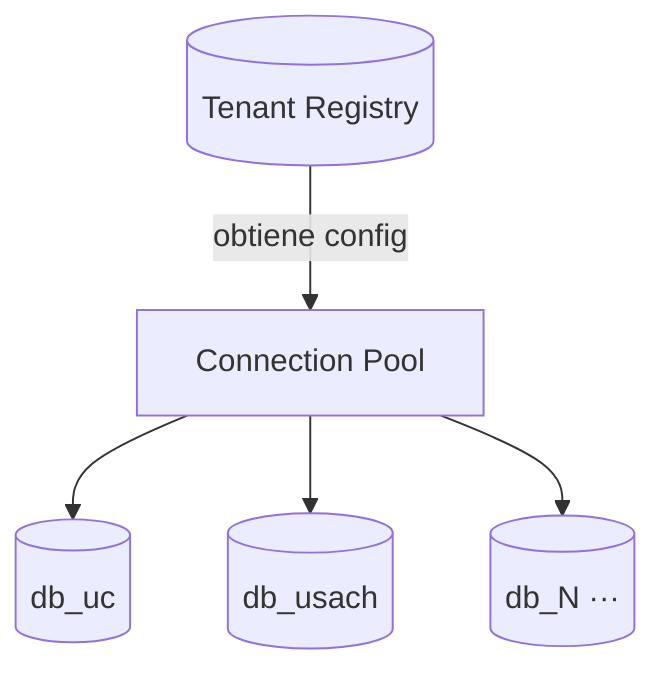
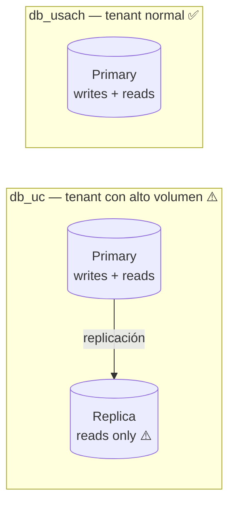

# Arquitectura — Diagrama y Componentes

> El grueso de las decisiones, trade-offs y justificaciones extendidas está en [architecture.md](architecture.md).

**Leyenda:**

| Símbolo | Significado |
|---|---|
| ✅ Base | Presente desde el primer despliegue |
| ⚠️ Condicional | Diseñado en la arquitectura; se activa cuando el despliegue o la carga lo justifique |
| 🔍 En veremos | Necesario para features específicas; se decide al especificar esa US |

---

## Diagrama Principal

---

## Componentes

| Componente | Estado | Justificación | Cuándo se activa |
|---|---|---|---|
| Frontend — Next.js | ✅ Base | Dashboard, vistas de curso, evaluaciones y libro de notas requieren cliente web con rutas claras y TypeScript. Desplegado en GCP (Cloud Run o GCS estático). | Desde el inicio. |
| Backend — NestJS (monolito modular) | ✅ Base | Dominio académico organizado por módulos: Auth, Tenancy, Courses, Materials, Assignments, Grades, Audit. Monolito modular permite avanzar rápido sin la complejidad operacional de microservicios. | Desde el inicio. |
| Auth JWT (dentro del backend) | ✅ Base | RF1 exige autenticación en cada request. JWT stateless permite escalar el backend horizontalmente sin sesión compartida. Implementado como NestJS AuthGuard + JwtStrategy. | Desde el inicio. |
| Tenant Resolver (middleware) | ✅ Base | RF2 exige resolver el tenant por subdominio en cada request. Middleware que lee el subdominio, consulta el registry, obtiene la config de BD y la inyecta en el contexto de la request. Stateless: cualquier réplica puede atender cualquier tenant. | Desde el inicio. |
| Tenant Registry — PostgreSQL central | ✅ Base | Mapea subdominio → `{tenant_id, db_host, db_name, credenciales}`. BD separada y pequeña (una fila por universidad). Se carga en memoria al arrancar el backend con TTL corto. No requiere nuevo tipo de servicio: es una PostgreSQL estándar en GCP Cloud SQL. | Desde el inicio. |
| PostgreSQL por tenant — GCP Cloud SQL | ✅ Base | Aislamiento fuerte de datos entre universidades. Permite backups, restores y escalamiento independiente por institución. Constituye el sharding natural del sistema: un shard = un tenant. Ver estrategia de BD abajo. | Desde el inicio. |
| Google Cloud Storage | ✅ Base | RF8, RF11, RF20: PDFs, presentaciones y entregas no se almacenan en PostgreSQL. La BD guarda metadatos y `storage_key`; los binarios viven en GCS. Disponible en el free tier de GCP ($300, 3 meses). | Desde el inicio. |
| API Gateway / Load Balancer — GCP Cloud Load Balancing | ⚠️ Condicional | Necesario al desplegar múltiples réplicas del backend. Unifica reverse proxy y load balancing en un solo componente administrado por GCP. Cloud Run puede manejar esto automáticamente dentro de su capa de enrutamiento. | Al desplegar más de una instancia del backend o requerir terminación TLS centralizada en producción. |
| Backend stateless — réplicas horizontales | ⚠️ Condicional | El backend no guarda estado local (sin sesiones en memoria, JWT valida por sí solo). Esto permite levantar réplicas frente a spikes de evaluaciones o entregas (RNF2, escenario de 1.000 concurrentes). Cada réplica es una instancia adicional de Cloud Run. | Cuando la carga normal o el spike de evaluaciones lo justifique. |
| Connection Pool — PgBouncer | ⚠️ Condicional | Con múltiples tenants y réplicas del backend, las conexiones a PostgreSQL pueden saturarse. PgBouncer reduce las conexiones activas reutilizando las existentes (transaction pooling). | Cuando el número de tenants o la concurrencia empiece a presionar los límites de conexiones de Cloud SQL. |
| Redis | 🔍 En veremos | Tres usos potenciales, cada uno ligado a features concretas: **(1) job queue para Workers** (necesario para US11, US14 y US17 si el procesamiento bloquea requests); **(2) caché de dashboard** (US1, US2, US4 a escala si las consultas directas no cumplen RNF6); **(3) session store** (si se reemplaza JWT stateless por sesiones servidor). Se incorpora solo si un plan técnico justifica uno de estos usos antes de implementar la US correspondiente. | Al especificar las US que lo requieran o si dashboards a escala no cumplen los escenarios de calidad. |
| Workers | 🔍 En veremos | Procesos que no deben bloquear una request HTTP: procesamiento de archivos subidos (US11 material, US14 entregas), recálculo de promedios cuando cambian ponderaciones (US17), dispatch de notificaciones (US35, RFO6). Requieren Redis como cola. Se activan junto a Redis al implementar las US que los justifiquen; hasta entonces, el procesamiento es síncrono. | Al implementar las US de procesamiento de archivos, recálculo de notas o notificaciones async. |

---

## Multi-tenancy: Resolución de Tenant

> Cualquier réplica del backend puede atender cualquier tenant porque la resolución es stateless por request. El Registry se mantiene pequeño y se cachea en memoria con TTL corto para evitar consultas en cada request.

---

## Estrategia de Base de Datos

### Shard = tenant

Cada universidad tiene su propia BD de PostgreSQL en GCP Cloud SQL. El sharding está implementado desde el inicio: no es una decisión futura. Un shard = un tenant. No hay tablas compartidas entre universidades.

### Replicación por tenant: primary → replica

El MVP parte con solo primary por tenant. Se agrega replica de lectura por tenant cuando ese tenant específico justifique mayor capacidad de reads. Las réplicas son independientes: UC puede tenerla mientras USACH sigue sin ella.

| Estado | Configuración | Cuándo |
|---|---|---|
| ✅ MVP | Solo primary por tenant | Inicio — suficiente para 5 universidades en semestre académico |
| ⚠️ Condicional | Primary + read replica por tenant | Cuando reads de un tenant específico saturen el primary |
| 🔍 Posterior | Sub-sharding interno de un tenant | Si una universidad crece tanto que una instancia no la sostiene — fuera del alcance del proyecto |
