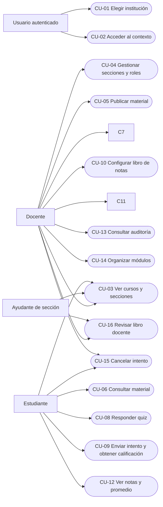

# Casos de uso y requerimientos

## Contexto funcional y alcance

AcademiX reúne el recorrido académico del MVP: elegir una institución, acceder a
cursos y secciones, organizar módulos y material, rendir quizzes de alternativas,
calcular y publicar notas, consultar el promedio y revisar cambios sensibles.
Los casos siguientes describen metas funcionales completas; varias operaciones
pueden contribuir a una misma meta. No representan una lista de endpoints ni
prometen funciones fuera del [alcance de Entrega 2](02-scope.md).

Los actores son el **usuario autenticado** (para elegir y entrar a una
institución), el **docente** (`teacher`), el **ayudante** (`assistant`) y el
**estudiante** (`student`). Una persona puede acumular roles, incluso dentro de
una misma sección; en cada operación se comprueba el permiso correspondiente.
La pertenencia institucional activa permite entrar al contexto, pero no confiere
por sí sola permisos académicos. El sistema ejecuta las validaciones y cálculos;
no se trata como actor externo. No hay administrador institucional separado,
coordinador de curso ni RBAC completo en el MVP.

Los casos se agrupan por acceso (CU-01 a CU-03), gestión de curso y contenido
(CU-04 a CU-07 y CU-14), evaluación y calificaciones (CU-08 a CU-12, CU-15 y
CU-16) y trazabilidad (CU-13). Se conservan los identificadores originales,
normalizados con dos dígitos. CU-14 a CU-16 completan metas explícitas del
modelo vigente.

## Casos de uso del MVP

| Caso | Meta principal |
| --- | --- |
| [CU-01](#cu-01--elegir-institución) | Elegir una institución accesible. |
| [CU-02](#cu-02--acceder-al-contexto-institucional) | Entrar al contexto institucional autorizado. |
| [CU-03](#cu-03--ver-cursos-y-secciones) | Encontrar cursos y secciones propios. |
| [CU-04](#cu-04--gestionar-secciones-y-roles) | Mantener secciones y participantes del curso. |
| [CU-05](#cu-05--publicar-material) | Poner material a disposición del curso. |
| [CU-06](#cu-06--consultar-material) | Acceder a material publicado. |
| [CU-07](#cu-07--crear-y-publicar-quiz) | Preparar y ofrecer un quiz válido. |
| [CU-08](#cu-08--responder-quiz) | Guardar respuestas en un intento propio. |
| [CU-09](#cu-09--enviar-intento-y-obtener-calificación-automática) | Finalizar un intento y registrar su calificación. |
| [CU-10](#cu-10--configurar-libro-de-notas) | Definir ponderaciones del curso. |
| [CU-11](#cu-11--publicar-notas) | Hacer visibles notas calificadas. |
| [CU-12](#cu-12--ver-notas-y-promedio) | Consultar notas propias publicadas. |
| [CU-13](#cu-13--consultar-auditoría) | Revisar historial académico del curso. |
| [CU-14](#cu-14--organizar-módulos-del-curso) | Ordenar y publicar módulos. |
| [CU-15](#cu-15--cancelar-un-intento-en-progreso) | Cerrar un intento abandonado sin calificarlo. |
| [CU-16](#cu-16--revisar-el-libro-de-notas-docente) | Consultar resultados del curso dentro del alcance autorizado. |

### Vista funcional de actores y casos

El siguiente diagrama usa nodos ovalados para los casos de uso y flechas para
la relación actor–meta. Mermaid no proporciona una figura nativa de caso de uso
UML; la aproximación conserva únicamente actores, casos y sus asociaciones.

### Reglas comunes de lectura

En todos los casos académicos, el usuario está autenticado y mantiene una
pertenencia activa a la institución elegida, salvo que un flujo alternativo
indique la pérdida de esa condición. Un recurso inexistente o ajeno a la
institución no se revela; una acción prohibida sobre un recurso visible se
rechaza. Estas reglas se aplican de nuevo en cada operación, sin asumir que una
validación anterior sigue vigente. Los flujos detallan las variaciones propias
de cada meta.

## CU-01 — Elegir institución

### Descripción

El usuario identifica entre sus instituciones accesibles aquella en la que
quiere trabajar. **Meta:** seleccionar un contexto institucional válido para
continuar sus actividades.

### Actores

- Usuario autenticado.

### Stakeholders

- Usuario: necesita distinguir sus contextos de trabajo.
- Instituciones a las que pertenece: requieren que solo se ofrezcan contextos autorizados.

### Precondiciones

- El usuario posee una identidad autenticada vigente.

### Postcondiciones

- El contexto elegido corresponde a una institución con pertenencia activa del usuario; aún no se le atribuye un rol académico por esa elección.

### Trigger

- El usuario abre el selector de instituciones.

### Flujo básico

1. El usuario solicita ver las instituciones a las que puede acceder.
2. El sistema muestra solo instituciones con pertenencia activa de ese usuario.
3. El usuario elige una de las instituciones mostradas.
4. El sistema establece la institución elegida como contexto de navegación y conduce al usuario a ella.

### Flujos alternativos

#### FA-01 — Sin instituciones accesibles

**Se origina en:** Paso 2 del flujo básico, cuando no hay pertenencias institucionales activas.

1. El sistema muestra una lista vacía e informa que no hay instituciones disponibles.
2. El usuario permanece fuera de un contexto académico.

**Resultado:** No se selecciona institución ni se accede a datos académicos.

#### FA-02 — La pertenencia deja de estar activa

**Se origina en:** Paso 4 del flujo básico, cuando la pertenencia cambió desde que se mostró la lista.

1. El sistema rechaza el acceso al contexto elegido sin revelar sus datos.
2. El sistema devuelve al usuario a la selección de instituciones vigentes.

**Resultado:** No se establece un contexto no autorizado.

## CU-02 — Acceder al contexto institucional

### Descripción

El usuario entra a una institución seleccionada y reconoce los roles académicos
que tiene allí. **Meta:** trabajar únicamente dentro de un contexto al que
pertenece, sin confundir pertenencia institucional con autorización de curso.

### Actores

- Usuario autenticado.

### Stakeholders

- Institución: necesita preservar la separación de su información académica.
- Usuario: necesita conocer sus alcances reales en el contexto elegido.

### Precondiciones

- El usuario posee una identidad autenticada vigente.
- Existe una institución seleccionada o solicitada por el usuario.

### Postcondiciones

- El usuario permanece en una institución activa con pertenencia vigente y conoce sus roles disponibles; ninguna operación académica queda autorizada sin comprobar además el curso o la sección.

### Trigger

- El usuario navega a la institución elegida o solicita una vista dentro de ella.

### Flujo básico

1. El usuario solicita entrar a la institución seleccionada.
2. El sistema identifica la institución solicitada y verifica que sea visible para ese usuario.
3. El sistema confirma su pertenencia institucional activa y recupera sus roles de curso y sección en ese contexto.
4. El sistema presenta la identidad contextual y permite continuar hacia las vistas que correspondan a esos roles.

### Flujos alternativos

#### FA-01 — Institución inexistente o no visible

**Se origina en:** Paso 2 del flujo básico, cuando la institución no existe o el usuario no puede verla.

1. El sistema informa que el contexto solicitado no está disponible.
2. El sistema no entrega identidad contextual ni recursos académicos de esa institución.

**Resultado:** No se establece acceso institucional.

#### FA-02 — Pertenencia inactiva

**Se origina en:** Paso 3 del flujo básico, cuando la pertenencia institucional dejó de estar activa.

1. El sistema impide continuar en ese contexto.
2. El sistema ofrece volver a las instituciones accesibles.

**Resultado:** El usuario no puede operar en la institución solicitada.

## CU-03 — Ver cursos y secciones

### Descripción

El participante localiza su trabajo académico dentro de una institución.
**Meta:** encontrar los cursos y secciones donde mantiene un rol activo, con
visibilidad ajustada a su alcance.

### Actores

- Docente.
- Ayudante de sección.
- Estudiante.

### Stakeholders

- Equipo docente: necesita ubicar las secciones que atiende.
- Estudiantes: necesitan acceder solo a sus cursos y secciones.

### Precondiciones

- Se cumplen las reglas comunes de autenticación y pertenencia institucional.
- Existe al menos un curso en la institución seleccionada.

### Postcondiciones

- Se muestra un listado de cursos y secciones visibles conforme a las pertenencias académicas activas del actor; los datos del curso no cambian.

### Trigger

- El participante abre su lista de cursos o entra a un curso visible.

### Flujo básico

1. El participante solicita sus cursos en la institución elegida.
2. El sistema presenta únicamente cursos donde posee pertenencia académica activa.
3. El participante selecciona un curso y solicita sus secciones.
4. El sistema muestra todas las secciones al docente; al docente, ayudante o estudiante le muestra solo las secciones en que participa.
5. El participante abre una sección visible y consulta su información académica permitida.

### Flujos alternativos

#### FA-01 — Sin cursos visibles

**Se origina en:** Paso 2 del flujo básico, cuando el participante no tiene pertenencia académica activa en ningún curso.

1. El sistema presenta la lista vacía dentro de la institución.
2. El sistema no muestra cursos de otros usuarios o instituciones.

**Resultado:** No se abre un curso ni se modifica información.

#### FA-02 — Curso o sección fuera del alcance

**Se origina en:** Paso 4 o 5 del flujo básico, cuando el recurso solicitado no existe, pertenece a otra institución o ya no es visible para el actor.

1. El sistema rechaza la consulta sin confirmar la existencia de un recurso ajeno.
2. El sistema conserva al participante en el último listado autorizado.

**Resultado:** No se divulga información fuera de su alcance.

## CU-04 — Gestionar secciones y roles

### Descripción

El docente mantiene la organización y las personas de su curso.
**Meta:** disponer de secciones actualizadas y asignar roles académicos a
participantes de la misma institución.

### Actores

- Docente.

### Stakeholders

- Equipo docente: depende de asignaciones correctas para trabajar en sus secciones.
- Estudiantes: dependen de una inscripción de sección vigente.
- Institución: requiere trazabilidad de los cambios de participantes.

### Precondiciones

- Se cumplen las reglas comunes de autenticación y pertenencia institucional.
- El curso existe y el actor tiene rol `teacher` activo en al menos una sección
  del curso, o el actor está creando el curso junto con su primera sección.
- La persona a incorporar ya posee pertenencia activa a la misma institución.

### Postcondiciones

- La sección queda creada o actualizada y la pertenencia académica queda registrada con el rol solicitado, dentro del curso y la institución correctos; los cambios sensibles quedan auditados.

### Trigger

- El docente solicita crear o actualizar una sección y asignar un participante.

### Flujo básico

1. El docente abre el curso y consulta sus secciones y participantes.
2. El sistema muestra todas las secciones y las pertenencias del curso que puede administrar.
3. El docente define o actualiza una sección y busca una persona perteneciente a la institución.
4. El sistema comprueba que la sección corresponde al curso y que la persona puede participar en esa institución.
5. El docente selecciona el rol de sección (`teacher`, `assistant` o `student`) y confirma la asignación.
6. El sistema registra la sección y la pertenencia de sección, y muestra la asignación vigente con su historial de cambio cuando corresponde.

### Flujos alternativos

#### FA-01 — Falta de rol `teacher`

**Se origina en:** Paso 2 o 6 del flujo básico, cuando el actor ya no tiene rol
`teacher` en el alcance administrado.

1. El sistema impide la modificación de secciones y pertenencias.
2. El sistema informa que la operación requiere rol docente activo.

**Resultado:** No cambia la organización del curso.

#### FA-02 — Participante o relación fuera de la institución

**Se origina en:** Paso 4 del flujo básico, cuando la persona, sección o curso no existe en el contexto solicitado o no pertenece a la misma institución.

1. El sistema rechaza la relación propuesta y no incorpora a la persona.
2. El docente puede elegir una persona y sección válidas.

**Resultado:** No se crea una relación académica cruzada o inexistente.

#### FA-03 — Rol activo duplicado o datos de sección inválidos

**Se origina en:** Paso 6 del flujo básico, cuando ya existe el mismo rol activo para esa persona y sección o los datos de sección incumplen una restricción.

1. El sistema informa el conflicto o el dato que debe corregirse.
2. El docente revisa la asignación existente o corrige la sección.

**Resultado:** Se conserva el estado previo sin duplicar roles activos.

#### FA-04 — Cambiar o desactivar una pertenencia

**Se origina en:** Paso 5 del flujo básico, cuando el docente selecciona una pertenencia existente en vez de crear otra.

1. El docente indica el nuevo rol o desactiva la pertenencia.
2. El sistema verifica que no se duplique un rol activo y registra el estado anterior y el nuevo.

**Resultado:** La pertenencia queda actualizada sin eliminar su historial.

#### FA-05 — Actualizar configuración general del curso

**Se origina en:** Paso 3 del flujo básico, cuando el docente decide modificar datos generales del curso antes de continuar con sus secciones.

1. El docente indica los datos del curso que deben cambiar.
2. El sistema valida la configuración y registra el cambio sensible dentro del mismo curso e institución.

**Resultado:** El curso queda actualizado sin crear otro curso ni alterar sus pertenencias.

## CU-05 — Publicar material

### Descripción

El docente prepara contenido de un módulo y decide cuándo hacerlo visible.
**Meta:** poner material académico autorizado a disposición de los estudiantes
del curso. En el MVP, módulos y materiales tienen alcance de curso completo:
todas las secciones del curso ven el mismo material publicado.

### Actores

- Docente.

### Stakeholders

- Estudiantes del curso: necesitan material publicado y accesible.
- Equipo docente: necesita que el contenido corresponda al módulo correcto.

### Precondiciones

- Se cumplen las reglas comunes de autenticación y pertenencia institucional.
- El docente tiene rol activo en el curso y existe un módulo de ese curso.
- Para visibilidad estudiantil, el módulo está publicado.

### Postcondiciones

- El material queda asociado al módulo y publicado dentro de la institución del curso; su publicación queda auditada.

### Trigger

- El docente solicita incorporar material a un módulo y publicarlo.

### Flujo básico

1. El docente abre el módulo del curso y elige crear material markdown o basado en archivo.
2. El sistema comprueba la pertenencia del módulo al curso y solicita el contenido y los metadatos pertinentes.
3. El docente proporciona el contenido o archivo admitido y confirma la creación.
4. El sistema registra el material en el módulo sin exponerlo aún a estudiantes.
5. El docente revisa el material y solicita publicarlo.
6. El sistema publica el material, registra el cambio sensible y lo deja visible en el módulo publicado.

### Flujos alternativos

#### FA-01 — Archivo o información inválida

**Se origina en:** Paso 3 o 4 del flujo básico, cuando faltan datos o el archivo no es PDF, CSV, XLSX, TXT, JPEG o PNG.

1. El sistema indica qué información o formato debe corregirse.
2. El docente puede volver a proporcionar un material válido.

**Resultado:** No se publica contenido inválido.

#### FA-02 — Módulo no visible o permiso insuficiente

**Se origina en:** Paso 2 o 6 del flujo básico, cuando el módulo no pertenece al curso e institución o el actor pierde el rol `teacher` requerido.

1. El sistema rechaza la creación o publicación según corresponda.
2. El sistema no revela un módulo de otra institución ni cambia material existente.

**Resultado:** No se crea ni publica material fuera del alcance.

#### FA-03 — Corregir u ocultar material existente

**Se origina en:** Paso 5 del flujo básico, cuando el docente elige modificar metadatos o retirar material ya publicado.

1. El docente indica el cambio permitido o solicita ocultar el material.
2. El sistema actualiza el contenido editable o retira la visibilidad estudiantil y registra el cambio sensible.

**Resultado:** El material permanece en su módulo con el estado de publicación actualizado; no se reemplaza el binario de un archivo existente.

## CU-06 — Consultar material

### Descripción

El estudiante consulta recursos didácticos de sus cursos. **Meta:** acceder al
contenido publicado que corresponde a su institución y a una sección en la que
mantiene inscripción activa. La sección autoriza el acceso al curso; no filtra
material distinto por paralelo.

### Actores

- Estudiante.

### Stakeholders

- Estudiante: necesita estudiar con el material correcto.
- Equipo docente: necesita distribuir solo versiones publicadas.

### Precondiciones

- Se cumplen las reglas comunes de autenticación y pertenencia institucional.
- El estudiante tiene inscripción `student` activa en una sección del curso.
- Existe al menos un módulo y material publicados del curso.

### Postcondiciones

- El estudiante recibe el material publicado solicitado; el estado académico no cambia.

### Trigger

- El estudiante abre los módulos de su curso o selecciona un material.

### Flujo básico

1. El estudiante abre el curso al que está inscrito mediante una de sus secciones y solicita sus módulos.
2. El sistema muestra únicamente módulos publicados y, dentro de ellos, materiales publicados.
3. El estudiante selecciona un material.
4. El sistema verifica su acceso vigente y muestra el markdown o entrega el archivo autorizado sin revelar su ubicación interna.

### Flujos alternativos

#### FA-01 — Contenido no publicado o inexistente

**Se origina en:** Paso 2 o 4 del flujo básico, cuando el módulo o material está oculto, no existe o es ajeno al contexto.

1. El sistema no incluye el contenido en el listado o rechaza su apertura.
2. El estudiante permanece en los contenidos publicados disponibles.

**Resultado:** No se divulga material no publicado ni de otra institución.

#### FA-02 — Inscripción inactiva

**Se origina en:** Paso 4 del flujo básico, cuando la inscripción estudiantil dejó de estar activa.

1. El sistema deniega la consulta del material.
2. El sistema informa que el curso ya no está disponible para ese estudiante.

**Resultado:** No se entrega el contenido solicitado.

## CU-07 — Crear y publicar quiz

### Descripción

El docente autorizado prepara una evaluación de alternativas.
**Meta:** ofrecer a los estudiantes un quiz válido, con pauta protegida y
alcance de curso o sección según el rol del autor.

### Actores

- Docente.

### Stakeholders

- Estudiantes destinatarios: necesitan una evaluación disponible y consistente.
- Equipo docente: necesita una pauta correcta y notas vinculables al libro de notas.

### Precondiciones

- Se cumplen las reglas comunes de autenticación y pertenencia institucional.
- El curso existe y el docente tiene rol `teacher` activo dentro del alcance que
  quiere administrar.

### Postcondiciones

- El quiz queda publicado con preguntas y pauta válidas, disponible en su alcance autorizado y vinculado a un único elemento del libro de notas; la publicación queda auditada.

### Trigger

- El docente solicita preparar un quiz para su curso o sección.

### Flujo básico

1. El actor elige el curso y, si corresponde, la sección destinataria.
2. El sistema verifica su alcance: el docente puede elegir el curso o una
sección donde mantiene rol `teacher` activo.
3. El actor define los datos del quiz y su política de intentos; el sistema lo guarda como borrador.
4. El actor agrega preguntas con puntajes, al menos dos alternativas por pregunta y una respuesta correcta en cada una.
5. El sistema conserva la pauta en la vista de autoría, separada de la vista estudiantil.
6. El actor revisa el borrador y solicita publicarlo.
7. El sistema valida preguntas, pauta, fechas y puntajes, crea o confirma el elemento de nota único y publica el quiz con auditoría.

### Flujos alternativos

#### FA-01 — Alcance o rol insuficiente

**Se origina en:** Paso 2 o 7 del flujo básico, cuando el docente elige otra sección o pierde el rol requerido.

1. El sistema rechaza la creación o publicación fuera del alcance autorizado.
2. El sistema no expone la pauta ni modifica quizzes ajenos.

**Resultado:** El quiz no queda publicado por un actor sin permiso.

#### FA-02 — Pauta o configuración incompleta

**Se origina en:** Paso 4 o 7 del flujo básico, cuando falta una pregunta válida, hay alternativas insuficientes o duplicadas, más de una correcta, puntajes o fechas inválidos.

1. El sistema señala las condiciones incumplidas.
2. El actor corrige el borrador y puede volver a solicitar publicación.

**Resultado:** El quiz conserva estado de borrador hasta superar la validación.

#### FA-03 — Quiz bloqueado o libro de notas ya publicado

**Se origina en:** Paso 3 o 7 del flujo básico, cuando el quiz ya fue publicado o utilizado, o existe una nota publicada del curso que impide agregar el elemento.

1. El sistema rechaza el cambio incompatible e informa el conflicto de estado.
2. El actor conserva la versión vigente sin alterar intentos ni notas.

**Resultado:** No se modifica una pauta protegida ni se añade un ítem después del bloqueo del libro.

## CU-08 — Responder quiz

### Descripción

El estudiante inicia un intento y guarda sus respuestas mientras trabaja.
**Meta:** rendir un quiz publicado en la sección que le corresponde sin perder
el control sobre su intento en progreso.

### Actores

- Estudiante.

### Stakeholders

- Estudiante: necesita conservar sus respuestas antes de enviarlas.
- Equipo docente: necesita intentos asociados a la sección correcta.

### Precondiciones

- Se cumplen las reglas comunes de autenticación y pertenencia institucional.
- El estudiante tiene rol `student` activo en la sección aplicable.
- El quiz está publicado y disponible para esa sección; no hay una nota suya ya publicada para ese quiz.

### Postcondiciones

- Existe un intento propio `in_progress`, numerado y asociado de forma histórica a la institución y sección; sus respuestas guardadas persisten sin calcular ni revelar una nota.

### Trigger

- El estudiante elige iniciar un quiz disponible.

### Flujo básico

1. El estudiante abre los quizzes publicados aplicables a su sección y elige uno.
2. El sistema comprueba inscripción vigente, disponibilidad, límite de intentos y ausencia de otro intento en progreso para ese estudiante y quiz.
3. El sistema crea el siguiente intento numerado, conservando institución y sección históricas, y presenta preguntas sin pauta.
4. El estudiante selecciona respuestas y solicita guardarlas.
5. El sistema revalida su permiso estudiantil, reemplaza las respuestas del intento en progreso y confirma el guardado sin mostrar corrección.

### Flujos alternativos

#### FA-01 — Quiz fuera de disponibilidad o sin intentos restantes

**Se origina en:** Paso 2 del flujo básico, cuando el quiz no está disponible o se alcanzó su máximo de intentos iniciados.

1. El sistema informa que no puede iniciarse otro intento.
2. El estudiante puede consultar los quizzes que siguen disponibles.

**Resultado:** No se crea un intento adicional; los cancelados siguen contando para el límite.

#### FA-02 — Intento en progreso o nota ya publicada

**Se origina en:** Paso 2 del flujo básico, cuando existe otro intento activo o una nota publicada del mismo quiz.

1. El sistema rechaza la creación de un intento nuevo e informa el conflicto de estado.
2. El estudiante puede volver al intento aún activo, si existe y conserva acceso.

**Resultado:** No se duplica un intento ni se reabre una nota publicada.

#### FA-03 — Permiso estudiantil perdido o acceso a pauta

**Se origina en:** Paso 2 o 5 del flujo básico, cuando la inscripción deja de estar activa o el usuario puede consultar la pauta como autor.

1. El sistema rechaza iniciar o guardar respuestas, según el momento.
2. El sistema no revela la pauta ni acepta cambios en las respuestas.

**Resultado:** No se rinde un quiz con permisos incompatibles.

#### FA-04 — Respuestas inválidas o intento cerrado

**Se origina en:** Paso 5 del flujo básico, cuando las respuestas no corresponden a las preguntas o el intento ya está enviado, calificado o cancelado.

1. El sistema informa el error de datos o el estado terminal del intento.
2. El estudiante corrige respuestas solo si el intento aún está en progreso.

**Resultado:** Las respuestas previas no se sustituyen por datos inválidos ni se altera un intento cerrado.

## CU-09 — Enviar intento y obtener calificación automática

### Descripción

El estudiante finaliza un intento respondido. **Meta:** entregar sus respuestas
para que el sistema las califique y registre la nota vigente, sin divulgarla
antes de su publicación.

### Actores

- Estudiante.

### Stakeholders

- Estudiante: necesita confirmar que su entrega fue recibida.
- Equipo docente: necesita una calificación reproducible y vinculada al intento correcto.

### Precondiciones

- Se cumplen las reglas comunes de autenticación y pertenencia institucional.
- El estudiante es propietario de un intento `in_progress` de un quiz publicado y conserva rol `student` activo.
- El usuario no posee acceso actual a la pauta de ese quiz; la nota correspondiente aún no está publicada.

### Postcondiciones

- El intento queda `graded`, con respuestas inmovilizadas; la nota vigente corresponde al último intento calificado por número y queda asociada al elemento del libro de notas sin exposición estudiantil anticipada.

### Trigger

- El estudiante confirma el envío de su intento.

### Flujo básico

1. El estudiante revisa sus respuestas guardadas y solicita enviar el intento.
2. El sistema comprueba propiedad, inscripción vigente, ausencia de acceso a pauta y estado `in_progress`.
3. El sistema inmoviliza las respuestas y las compara con la pauta del quiz.
4. El sistema calcula puntaje y nota según las reglas de calificación del curso.
5. El sistema registra el intento calificado y crea o actualiza la nota vigente si es el último intento calificado; confirma la recepción sin mostrar la nota aún no publicada.

### Flujos alternativos

#### FA-01 — Permiso vigente insuficiente

**Se origina en:** Paso 2 del flujo básico, cuando el estudiante perdió la inscripción o adquirió acceso a la pauta.

1. El sistema rechaza el envío y explica que no puede rendir con los permisos actuales.
2. El sistema conserva el intento y las respuestas previas sin calificarlos.

**Resultado:** No se genera nota por un envío no autorizado.

#### FA-02 — Intento inexistente, ajeno o cerrado

**Se origina en:** Paso 2 del flujo básico, cuando el intento no es visible, está cancelado o ya fue procesado con una solicitud incompatible.

1. El sistema deniega el acceso a intentos ajenos o indica el conflicto de estado del propio intento.
2. El sistema no vuelve a calificar ni duplica la nota.

**Resultado:** El registro académico permanece consistente; repetir la misma solicitud identificada conserva su resultado previo.

#### FA-03 — Nota ya publicada

**Se origina en:** Paso 2 o 5 del flujo básico, cuando la nota se publicó antes de completar el envío.

1. El sistema impide el envío o la sustitución de la nota publicada.
2. El sistema informa que la calificación ya no admite nuevos intentos.

**Resultado:** No se modifica una nota publicada.

## CU-10 — Configurar libro de notas

### Descripción

El docente establece el peso de las evaluaciones del curso. **Meta:**
dejar un libro de notas coherente para publicar resultados y calcular el
promedio parcial.

### Actores

- Docente.

### Stakeholders

- Equipo docente: necesita ponderaciones conocidas para interpretar notas.
- Estudiantes: dependen de un promedio calculado con pesos correctos.

### Precondiciones

- Se cumplen las reglas comunes de autenticación y pertenencia institucional.
- El actor tiene rol `teacher` activo en un curso existente con elementos de nota vinculados a quizzes publicados.
- Todavía no existe una nota publicada del curso.

### Postcondiciones

- El conjunto completo de ponderaciones del curso queda guardado, suma 100 % y tiene un evento de auditoría; no se altera una nota ya calculada o publicada.

### Trigger

- El docente solicita configurar las ponderaciones del libro de notas.

### Flujo básico

1. El docente abre los elementos de nota del curso y su suma actual de ponderaciones.
2. El sistema muestra los elementos asociados a quizzes del mismo curso.
3. El docente asigna un peso a cada elemento y confirma el conjunto completo.
4. El sistema verifica que los elementos correspondan al curso y que la suma sea 100 %.
5. El sistema guarda las ponderaciones en conjunto, registra la modificación y muestra la configuración vigente.

### Flujos alternativos

#### FA-01 — Suma o conjunto inválido

**Se origina en:** Paso 4 del flujo básico, cuando faltan elementos, se referencia uno ajeno o la suma difiere de 100 %.

1. El sistema señala la inconsistencia de los pesos o elementos.
2. El docente corrige el conjunto antes de volver a confirmarlo.

**Resultado:** No se guarda una configuración parcial o inválida.

#### FA-02 — Ponderaciones bloqueadas

**Se origina en:** Paso 4 o 5 del flujo básico, cuando ya se publicó alguna nota del curso.

1. El sistema informa que la primera publicación bloqueó cambios de pesos y nuevos elementos.
2. El docente conserva la configuración previa.

**Resultado:** Las ponderaciones publicadas no cambian silenciosamente.

#### FA-03 — Curso no visible o falta de rol `teacher`

**Se origina en:** Paso 1 o 5 del flujo básico, cuando el curso no pertenece al contexto o el actor deja de ser docente.

1. El sistema no entrega elementos ajenos ni acepta la modificación.
2. El actor permanece en los cursos que puede consultar.

**Resultado:** El libro de notas queda sin cambios.

## CU-11 — Publicar notas

### Descripción

El docente decide qué notas calificadas se comunican a los
estudiantes. **Meta:** hacer visibles resultados ya calculados dentro del
alcance académico autorizado.

### Actores

- Docente.

### Stakeholders

- Estudiantes afectados: necesitan conocer resultados definitivos para esa publicación.
- Equipo docente: necesita evitar publicaciones incompletas o contradictorias.
- Institución: requiere historial de la publicación de registros académicos.

### Precondiciones

- Se cumplen las reglas comunes de autenticación y pertenencia institucional.
- Existen notas originadas por intentos calificados en los elementos y secciones seleccionados.
- El actor mantiene rol `teacher` en el curso o en las secciones que selecciona.

### Postcondiciones

- Las notas seleccionadas quedan publicadas y visibles para sus propietarios; no se sobrescriben notas publicadas y se registra auditoría de la operación.

### Trigger

- El docente solicita publicar notas de uno o más elementos y secciones.

### Flujo básico

1. El actor consulta el libro de notas del curso dentro de su alcance y selecciona elementos y secciones.
2. El sistema muestra solo las notas calificadas y secciones que el actor puede publicar.
3. El actor revisa la selección y confirma la publicación.
4. El sistema valida los permisos vigentes, que las ponderaciones sumen 100 % y que no haya intentos `in_progress` de los estudiantes y quizzes afectados.
5. El sistema publica en conjunto las notas seleccionadas, conserva su valor y registra el evento de auditoría.
6. El sistema confirma qué notas quedaron visibles para sus estudiantes.

### Flujos alternativos

#### FA-01 — Sección fuera del alcance docente

**Se origina en:** Paso 2 o 4 del flujo básico, cuando un docente incluye una sección que no enseña o pierde el rol.

1. El sistema rechaza la selección no autorizada.
2. El actor puede seleccionar solo sus secciones vigentes.

**Resultado:** No se publica ninguna nota fuera de su alcance.

#### FA-02 — Ponderaciones incompletas o sin nota calificada

**Se origina en:** Paso 4 del flujo básico, cuando es la primera publicación y los pesos no suman 100 %, o la selección carece de nota originada por intento `graded`.

1. El sistema informa qué condición académica falta.
2. El actor corrige la configuración mediante CU-10 o espera una entrega calificada mediante CU-09.

**Resultado:** No se publican notas incompletas.

#### FA-03 — Intento aún en progreso

**Se origina en:** Paso 4 del flujo básico, cuando uno de los estudiantes y quizzes seleccionados conserva un intento `in_progress`.

1. El sistema detiene la publicación e identifica el conflicto dentro del alcance autorizado.
2. El actor puede resolver el intento abandonado mediante CU-15 y volver a solicitar la publicación.

**Resultado:** No se cancela automáticamente el intento ni se publican las notas seleccionadas.

#### FA-04 — Nota ya publicada o selección incompatible

**Se origina en:** Paso 4 o 5 del flujo básico, cuando se intenta sobrescribir una nota publicada o se incluyen elementos ajenos al curso.

1. El sistema informa el conflicto o la selección inválida.
2. El actor revisa las notas y elementos vigentes.

**Resultado:** Se conserva la publicación anterior sin sobrescritura.

## CU-12 — Ver notas y promedio

### Descripción

El estudiante revisa su desempeño académico. **Meta:** conocer únicamente
sus notas publicadas y el promedio parcial derivado de ellas.

### Actores

- Estudiante.

### Stakeholders

- Estudiante: necesita conocer su progreso publicado.
- Equipo docente: necesita que el promedio refleje las ponderaciones del curso.

### Precondiciones

- Se cumplen las reglas comunes de autenticación y pertenencia institucional.
- El estudiante tiene inscripción activa en una sección del curso.

### Postcondiciones

- Se presentan solo las notas publicadas del estudiante y el promedio parcial calculado con sus ponderaciones publicadas; no se modifica ningún registro.

### Trigger

- El estudiante abre sus calificaciones de un curso.

### Flujo básico

1. El estudiante selecciona un curso en el que está inscrito y abre sus calificaciones.
2. El sistema identifica al estudiante por su sesión y recupera solo sus notas publicadas en ese curso e institución.
3. El sistema calcula el promedio parcial como suma de nota por ponderación dividida por la suma de ponderaciones de las notas publicadas.
4. El sistema presenta las notas y el promedio parcial, sin incluir notas aún no publicadas ni las de otras personas.

### Flujos alternativos

#### FA-01 — Sin notas publicadas

**Se origina en:** Paso 2 del flujo básico, cuando no existen notas propias publicadas.

1. El sistema informa que aún no hay calificaciones visibles.
2. El sistema no presenta un promedio sin ponderaciones publicadas.

**Resultado:** No se confunde ausencia de notas con una nota cero.

#### FA-02 — Curso o inscripción no visible

**Se origina en:** Paso 1 o 2 del flujo básico, cuando el curso es ajeno al contexto o la inscripción dejó de estar activa.

1. El sistema rechaza la consulta y no revela notas.
2. El estudiante vuelve a sus cursos disponibles.

**Resultado:** No se exponen calificaciones fuera de su alcance.

## CU-13 — Consultar auditoría

### Descripción

El docente examina cambios académicos sensibles de su curso. **Meta:**
reconstruir quién hizo un cambio, sobre qué recurso y cuándo, sin alterar el
historial.

### Actores

- Docente.

### Stakeholders

- Institución: necesita trazabilidad de registros académicos.
- Equipo docente y estudiantes afectados: tienen interés en la integridad de los cambios.

### Precondiciones

- Se cumplen las reglas comunes de autenticación y pertenencia institucional.
- El actor tiene rol `teacher` activo en alguna sección del curso existente.

### Postcondiciones

- Se presenta el historial autorizado del curso y su institución; los eventos permanecen inmutables y no exponen secretos ni pautas.

### Trigger

- El docente abre el historial académico del curso.

### Flujo básico

1. El docente selecciona su curso y solicita eventos de auditoría.
2. El sistema verifica su rol `teacher` vigente y muestra eventos del curso en la institución seleccionada.
3. El docente filtra, si lo necesita, por acción, recurso, actor, sección o período.
4. El sistema presenta los eventos coincidentes con fecha, actor y cambios sanitizados, sin permitir editarlos.

### Flujos alternativos

#### FA-01 — Curso ajeno o permiso perdido

**Se origina en:** Paso 2 o 4 del flujo básico, cuando el curso no es visible o el rol `teacher` deja de estar activo.

1. El sistema rechaza la consulta.
2. El sistema no revela eventos de otra institución o curso.

**Resultado:** El historial permanece protegido y sin modificaciones.

#### FA-02 — Filtro inválido o sin resultados

**Se origina en:** Paso 3 o 4 del flujo básico, cuando el filtro es inválido o no coincide con eventos.

1. El sistema solicita corregir el filtro inválido o informa que no hay coincidencias.
2. El docente puede ajustar los criterios de búsqueda.

**Resultado:** No se crean, eliminan ni alteran eventos por la consulta.

## CU-14 — Organizar módulos del curso

### Descripción

El docente estructura el contenido del curso antes de exponerlo.
**Meta:** disponer de módulos ordenados y decidir cuáles son visibles para los
estudiantes.

### Actores

- Docente.

### Stakeholders

- Equipo docente: necesita una secuencia de contenido coherente.
- Estudiantes: necesitan navegar solo por módulos publicados y en el orden previsto.

### Precondiciones

- Se cumplen las reglas comunes de autenticación y pertenencia institucional.
- El actor tiene rol `teacher` activo en un curso existente.

### Postcondiciones

- El módulo queda creado en el curso, su orden queda registrado y el módulo publicado resulta visible para estudiantes del curso; la publicación queda auditada.

### Trigger

- El docente solicita organizar el contenido de un curso.

### Flujo básico

1. El docente abre los módulos del curso y solicita crear uno.
2. El sistema muestra los módulos actuales y verifica que el actor tenga rol `teacher` activo en ese curso.
3. El docente proporciona los datos del módulo y confirma su creación.
4. El sistema lo registra en el curso y muestra el orden actual.
5. El docente ajusta el orden completo y solicita publicar el módulo preparado.
6. El sistema valida el orden propuesto, lo guarda y publica el módulo con auditoría.

### Flujos alternativos

#### FA-01 — Orden incompleto o datos inválidos

**Se origina en:** Paso 3 o 6 del flujo básico, cuando faltan datos del módulo o el orden omite, duplica o incluye módulos ajenos.

1. El sistema indica qué dato o posición debe corregirse.
2. El docente revisa la propuesta y puede volver a confirmarla.

**Resultado:** Se conserva el orden previo y no se publica una organización inválida.

#### FA-02 — Curso ajeno o falta de rol `teacher`

**Se origina en:** Paso 2 o 6 del flujo básico, cuando el curso no es visible o el rol `teacher` deja de estar activo.

1. El sistema rechaza la modificación y no muestra módulos ajenos.
2. El actor vuelve a sus cursos autorizados.

**Resultado:** No cambia el contenido de un curso fuera de alcance.

#### FA-03 — Actualizar u ocultar módulo

**Se origina en:** Paso 5 del flujo básico, cuando el docente selecciona un módulo existente para editarlo u ocultarlo.

1. El docente modifica sus datos o solicita retirar su publicación.
2. El sistema comprueba el estado y actualiza el módulo o su visibilidad, registrando el cambio sensible.

**Resultado:** Se conserva el módulo en su curso con los datos o estado de publicación actualizados.

## CU-15 — Cancelar un intento en progreso

### Descripción

El estudiante o el personal docente autorizado cierra un intento que no se
enviará. **Meta:** liberar un intento abandonado sin calificarlo ni alterar una
nota, para que no bloquee indebidamente la publicación.

### Actores

- Estudiante propietario del intento.
- Docente.
- Docente de la sección histórica del intento.

### Stakeholders

- Estudiante propietario: necesita conocer el estado final de su intento.
- Equipo docente: necesita resolver bloqueos antes de publicar notas.
- Institución: requiere registro de quién canceló el intento.

### Precondiciones

- Se cumplen las reglas comunes de autenticación y pertenencia institucional.
- Existe un intento `in_progress` del quiz en la institución.
- El estudiante conserva inscripción activa y no accede a la pauta, o el actor de personal conserva rol `teacher` del curso o docencia en la sección histórica.

### Postcondiciones

- El intento queda `cancelled` con fecha y actor auditados; conserva su número, cuenta para el límite de intentos, no genera nota y deja de bloquear la publicación.

### Trigger

- El estudiante o personal autorizado solicita cancelar un intento en progreso.

### Flujo básico

1. El actor abre el intento visible y solicita su cancelación.
2. El sistema verifica el estado `in_progress` y revalida propiedad o rol académico sobre el curso y sección históricos.
3. El sistema marca el intento como `cancelled`, registra fecha y evento de auditoría, sin generar una calificación.
4. El sistema confirma que el intento cerrado conserva su número, cuenta para el límite de intentos y ya no bloquea la publicación.

### Flujos alternativos

#### FA-01 — Falta de permiso actual

**Se origina en:** Paso 2 o 3 del flujo básico, cuando el actor perdió la inscripción o rol requerido, o el estudiante adquirió acceso a la pauta.

1. El sistema rechaza la cancelación.
2. El sistema conserva el intento en su estado previo.

**Resultado:** Ningún actor fuera de alcance cancela intentos.

#### FA-02 — Intento ya cancelado

**Se origina en:** Paso 2 o 3 del flujo básico, cuando la cancelación ya fue aplicada.

1. El sistema confirma que el intento está cancelado.
2. El sistema no registra un segundo evento ni modifica notas.

**Resultado:** Se mantiene el estado terminal y la auditoría única.

#### FA-03 — Intento enviado, calificado o no visible

**Se origina en:** Paso 2 del flujo básico, cuando el intento ya fue enviado o calificado, no existe o pertenece a otro contexto.

1. El sistema rechaza la transición incompatible o informa que el intento no está disponible.
2. El actor vuelve a los intentos que puede consultar.

**Resultado:** No se cancela una calificación ni se revela un intento ajeno.

## CU-16 — Revisar el libro de notas docente

### Descripción

El personal académico consulta calificaciones de sus estudiantes antes de
publicarlas o para dar seguimiento al curso. **Meta:** revisar filas del libro
de notas y, cuando sea necesario, los intentos que originan resultados dentro
del alcance de curso o sección permitido para cada rol.

### Actores

- Docente.
- Ayudante de sección.

### Stakeholders

- Equipo docente: necesita detectar resultados pendientes y dar seguimiento académico.
- Estudiantes: necesitan que sus resultados sean consultados solo por personal autorizado.
- Institución: requiere resguardar la confidencialidad de las calificaciones.

### Precondiciones

- Se cumplen las reglas comunes de autenticación y pertenencia institucional.
- El actor tiene rol `teacher` activo en alguna sección del curso o rol `teacher` o `assistant` activo en una de sus secciones.
- El curso existe dentro de la institución seleccionada.

### Postcondiciones

- Se presentan únicamente filas del libro de notas y, si se solicitan, intentos del curso o de las secciones autorizadas; la consulta no modifica notas ni su estado de publicación.

### Trigger

- El miembro del equipo académico abre el libro de notas del curso.

### Flujo básico

1. El actor selecciona un curso y solicita consultar su libro de notas.
2. El sistema verifica su rol y muestra al docente el curso completo; al docente o ayudante le exige una sección propia.
3. El docente o ayudante selecciona una sección en que mantiene rol activo, si corresponde.
4. El sistema muestra las filas y elementos de nota dentro de ese alcance, con sus resultados y estado de publicación.
5. El actor revisa los resultados sin alterar el libro mediante esta consulta.

### Flujos alternativos

#### FA-01 — Sección ajena o rol perdido

**Se origina en:** Paso 2, 3 o 4 del flujo básico, cuando el actor solicita una sección fuera de sus roles vigentes.

1. El sistema rechaza la consulta fuera de alcance.
2. El actor puede elegir una sección donde aún participa.

**Resultado:** No se exponen calificaciones de otra sección.

#### FA-02 — Curso o sección inexistente en el contexto

**Se origina en:** Paso 2 o 4 del flujo básico, cuando el recurso no existe o pertenece a otra institución.

1. El sistema informa que el recurso no está disponible.
2. El actor regresa a sus cursos y secciones visibles.

**Resultado:** No se revela la existencia de datos de otra institución.

#### FA-03 — Ayudante intenta modificar o publicar

**Se origina en:** Paso 5 del flujo básico, cuando un ayudante solicita una acción de escritura desde el libro consultado.

1. El sistema impide la modificación y explica que el rol `assistant` es de solo lectura en el libro.
2. El ayudante conserva la vista autorizada sin cambios.

**Resultado:** No se modifican ni publican notas mediante el rol de ayudante.

#### FA-04 — Revisar intentos del quiz

**Se origina en:** Paso 5 del flujo básico, cuando el actor decide consultar los intentos relacionados con un quiz del libro.

1. El actor selecciona el quiz y, si es docente o ayudante, una de sus secciones activas.
2. El sistema muestra solo los intentos de ese alcance y permite abrir una vista académica autorizada del intento.
3. El actor revisa el resultado sin cambiar respuestas ni calificaciones.

**Resultado:** La revisión queda limitada a intentos visibles y no modifica registros académicos.

## Revisión de mockups por rol — Issue #22

El seguimiento de [Issue #22](https://github.com/dvillas28/lock-in-team-iic3143-202602/issues/22)
incorpora las correcciones y nuevos mockups solicitados después del mapeo inicial.
Se mantienen estos CU, el [alcance](02-scope.md) y el
[modelo de dominio](05-domain-model.md) como fuente vigente; las US y BPMN de
Entregas 0/1 son antecedentes históricos. `specs/` no contiene otro alcance funcional.

Hay **17 HTML: 16 pantallas y una galería**. Se reutilizan tokens, shell,
formularios, tablas y tarjetas existentes. Las siete pantallas nuevas (10–16)
agrupan metas relacionadas para evitar una pantalla artificial por CU.
El acceso de login es previo a CU-01/CU-02 y la landing/galería no constituyen
casos de uso académicos nuevos.

### Experiencia / rol → vista → caso de uso

| Experiencia / perfil | Vista / mockup | Casos de uso vigentes | Propósito y evidencia visual |
| --- | --- | --- | --- |
| Compartido | [Galería](../../../mockups/index.html) | Sin CU operativo | Dos experiencias académicas y cuatro perfiles de demostración. |
| Público | [Landing](../../../mockups/01-landing.html) | Acceso previo | Propuesta de valor y acceso global. |
| Compartido | [Acceso a AcademiX](../../../mockups/02-login.html) | Acceso previo | Acceso de demostración previo a elegir institución (RF1); sin invitación ni branding por subdominio. |
| No admin · estudiante, ayudante o docente | [Mis cursos](../../../mockups/03-dashboard.html) | CU-02 — Acceder al contexto institucional; CU-03 — Ver cursos y secciones | Inicio no admin compartido; docente gestiona su sección y contenido, ayudante consulta y estudiante rinde. |
| No admin · consulta | [Curso y módulos](../../../mockups/04-course-modules.html) | CU-03 — Ver cursos y secciones; CU-06 — Consultar material | Solo módulos publicados, lectura markdown y PDF; controles por teclado. |
| Estudiante | [Quizzes](../../../mockups/05-evaluations.html) | CU-08 — Responder quiz; CU-09 — Enviar intento y obtener calificación automática; CU-12 — Ver notas y promedio | Listado de quizzes, inicio/reanudación y acceso a notas publicadas; envío detallado en 14. |
| Estudiante | [Calificaciones](../../../mockups/06-grades.html) | CU-12 — Ver notas y promedio | Notas propias publicadas, promedio parcial 6.1, ponderación 65 % y estado sin notas. |
| Admin · docente | [Administrar mis cursos](../../../mockups/07-teacher-dashboard.html) | CU-02 — Acceder al contexto institucional; CU-03 — Ver cursos y secciones | Inicio admin con gestión académica de todas las secciones del curso. |
| Docente admin/no admin; ayudante (consulta) | [Libro de notas](../../../mockups/08-teacher-gradebook.html) | CU-10 — Configurar libro de notas; CU-11 — Publicar notas; CU-16 — Revisar el libro de notas docente | Admin configura pesos comunes; ambos docentes publican dentro de su alcance. Ayudante solo consulta sección 2. |
| Estudiante | [Lector de documentos](../../../mockups/09-pdf-reader.html) | CU-06 — Consultar material | PDF de ejemplo y retorno al módulo, sin IA; archivo condicionado al almacenamiento futuro. |
| Usuario autenticado (compartido) | [Elegir institución](../../../mockups/10-institutions.html) | CU-01 — Elegir institución; CU-02 — Acceder al contexto institucional | Instituciones accesibles, roles disponibles, lista vacía, contexto no disponible y UTFSM sin cursos. |
| Docente admin/no admin | [Secciones y roles](../../../mockups/11-course-management.html) | CU-04 — Gestionar secciones y roles | Admin gestiona todas las secciones y crea nuevas; docente no admin asigna/desactiva participantes solo en su sección. |
| Docente admin/no admin | [Módulos y material](../../../mockups/12-content-editor.html) | CU-14 — Organizar módulos del curso; CU-05 — Publicar material | Contenido compartido: creación y orden de módulos, edición de ítems y check verde de publicación independiente por fila. |
| Docente admin/no admin | [Autoría de quiz](../../../mockups/13-quiz-editor.html) | CU-07 — Crear y publicar quiz | Ambos docentes crean quizzes y acceden a pauta; no admin dirige el quiz a su sección y admin puede seleccionar todas. |
| Estudiante | [Responder quiz](../../../mockups/14-quiz-attempt.html) | CU-08 — Responder quiz; CU-09 — Enviar intento y obtener calificación automática; CU-15 — Cancelar un intento en progreso | Guardar/reanudar, envío sin nota anticipada, cancelación terminal y máximo; nota publicada o acceso a pauta bloquean rendición. |
| Docente admin/no admin | [Auditoría del curso](../../../mockups/15-audit.html) | CU-13 — Consultar auditoría | Auditoría sanitizada: admin consulta todas las secciones; docente no admin consulta la propia. |
| Docente admin/no admin; ayudante (consulta) | [Revisar intentos](../../../mockups/16-attempt-review.html) | CU-16 — Revisar el libro de notas docente; CU-15 — Cancelar un intento en progreso | Ambos docentes consultan/cancelan intentos dentro de su alcance; ayudante solo consulta su sección. |

### Cobertura y relaciones

Los **16 CU tienen representación de su meta principal**; no quedan CU sin
mockup principal en este inventario. El listado 05 conduce al flujo detallado 14;
03 es el inicio no admin compartido; 07 es el inicio admin. Libro/intentos
(08/16) permiten gestión docente por alcance y consulta del ayudante sin escritura. Las variantes
usan `role` y `experience`, sin una tercera experiencia por rol. Los escenarios ilustran flujos,
no equivalen a implementación de requisitos ni a pruebas de seguridad del producto.

- Acceso: 02 → 10 → 03 (no admin) o 07 (admin), con CU-01/CU-02/CU-03. UC y UTFSM son contextos
  de ejemplo accesibles; el estado UTFSM sin cursos no reutiliza datos de UC.
- Contenido: 12 organiza/publica módulos y material (CU-14/CU-05); 04 consulta
  markdown publicado y abre 09 para PDF (CU-06). Módulos y material son de curso,
  compartidos por las secciones y editables por ambos docentes. Cada módulo e ítem tiene un check verde de publicación independiente; la visibilidad efectiva exige ambos publicados.
- Evaluación: 13 prepara quiz/pauta (CU-07); 05 → 14 inicia/reanuda, guarda y
  envía (CU-08/CU-09). Ambos docentes acceden a autoría/pauta: no admin dirige el quiz a su sección; admin puede seleccionar todas. Tener además un rol
  estudiantil no habilita rendir cuando existe acceso a la pauta.
- Notas: el admin configura pesos comunes en 08 (CU-10); ambos docentes revisan filas dentro de su alcance (CU-16) y
  confirma evaluación, secciones y cantidad de notas (CU-11). 06 muestra solo
  notas propias publicadas y promedio parcial normalizado (CU-12).
- Cierre y trazabilidad: 14 permite cancelar al estudiante propietario;
  16 permite cancelar a ambos docentes dentro de su alcance (CU-15 en la propuesta de UI), sin nota y consumiendo un intento.
  Un intento en progreso detiene publicación; se cancela explícitamente, nunca
  de forma automática. 15 consulta eventos sanitizados e inmutables (CU-13).

### Dos experiencias y roles académicos

Los roles académicos siguen siendo `teacher`, `assistant`, `student` por
Enrollment. **Admin / No admin son experiencias según capacidad de administrar
el curso**, no nuevos roles institucionales. El usuario autenticado conserva el
acceso compartido. La galería agrupa ambas experiencias y las instituciones
ofrecen cuatro perfiles de ejemplo:

- Docente admin: Carla Contreras, perteneciente a sección 2, inicio 07. Gestiona todas las secciones del curso, crea secciones y configura políticas comunes.
- Docente no admin: la misma Carla, inicio 03 compartido. Gestiona participantes, quizzes, intentos y publicación de notas solo en sección 2. También edita/publica módulos y materiales compartidos por el curso.
- Ayudante no admin: Javier Morales, sección 2, mismo inicio 03 y consultas del libro/intentos de su sección sin escritura.
- Estudiante no admin: María González, sección 2, mismo inicio 03 con su avance, quizzes y notas propias publicadas. No ve registros de otros estudiantes.

La navegación conserva `role` y `experience=admin|non-admin`. Los enlaces de
escenarios seleccionan perfiles de demostración, sin otorgar privilegios reales.
Estudiante/ayudante siguen no admin ante un parámetro admin. Las rutas de gestión
docente deniegan acceso a estudiante/ayudante; el docente no admin conserva las
acciones de su sección. Los enlaces antiguos de ayudante a 07 conducen al inicio
compartido 03. Módulos e ítems ocultos se omiten de la consulta estudiantil.

La [decisión de UI y matriz de acciones](../../adr/ui-admin-non-admin-experiences.md)
registra el acuerdo y la dependencia funcional. El modelo/API vigente aún liga
administración a `teacher`: los CU/RF ligados a edición/publicación y cancelación
se deben reconciliar con estas capacidades antes de implementar. Esta revisión
no modifica silenciosamente sus precondiciones ni contratos de autorización.

Se retiraron entregas/corrección manual, recorrección, IA, anuncios/calendario,
exportación e invitación por token de las vistas operativas. La navegación conserva identidad, rol y experiencia admin/no admin al consultar
material, notas e intentos. El promedio del ejemplo se corrigió a **6.1**:
`(6.5×15 + 6.8×15 + 5.1×25 + 7.0×10) / 65`, con 65 % publicado.
Los controles de pesos/nuevos elementos se bloquean tras publicar y la
confirmación identifica la selección real. Las selecciones usan controles
nativos de teclado; los diálogos nativos gestionan foco, Escape y retorno.
Colores, incluido el papel fijo del lector, están centralizados en tokens.

Las páginas muestran enlaces «Escenarios del mockup»: memberships vacías,
acceso no disponible, sin cursos/notas, libro bloqueado, intento que bloquea
publicación, nota publicada, límite de intentos, roles incompatibles y permiso
de auditoría perdido. Los filtros de auditoría permiten mostrar ausencia de
coincidencias; los formularios ilustran validaciones de fechas, alternativas,
formatos, duplicados y suma de pesos.

### Límites y decisiones pendientes

- La separación rol/administración está definida para UI; representación,
  concesión/revocación y validación en dominio/API quedan pendientes según la
  decisión enlazada. La matriz visual no equivale a permisos implementados.
- Los HTML son estáticos: no hay JWT, API, autorización real, escritura de datos,
  auditoría persistida ni carga de archivos. Los resultados mostrados son
  escenarios independientes; no se sincronizan entre pantallas. Solo el intento
  estudiantil simula guardado/reanudación local en `sessionStorage` por contexto uc.
- 09 es un extracto ilustrativo de PDF, sin binario descargable; no demuestra
  storage. La lectura markdown de 04 cubre el material inmediato del MVP.
- CU-03/CU-16 y el contrato conservan una ambigüedad entre curso completo y sección propia para `teacher`. La regla acordada para UI la resuelve: admin gestiona todas las secciones; no admin gestiona su sección. Carla pertenece a sección 2, al igual que el ayudante. Representar la capacidad admin y alinear precondiciones/contratos permanece pendiente de implementación según la ADR; esta PR de mockups no modifica el backend.
- Hay estados representativos, no todas las combinaciones de flujos alternativos.
  Esta actualización cierra los vacíos de pantallas, sin ampliar el alcance ni
  sustituir la validación posterior de implementación.

## Requisitos funcionales

RF1. El sistema debe autenticar una identidad global mediante JWT.

RF2. El frontend debe listar únicamente Institutions accesibles para el User.

RF3. UC y UTFSM deben existir como Institutions con slugs únicos dentro de la
misma PostgreSQL compartida cuando se implemente persistencia.

RF4. Los endpoints académicos deben declarar el contexto mediante
`/api/v1/institutions/{institutionSlug}/...`.

RF5. El backend debe resolver el slug a un UUID interno y verificar una
`InstitutionMembership` activa antes de evaluar roles académicos.

RF6. Indicar una Institution en la URL no debe autenticar ni autorizar.

RF7. `User` debe ser global y poder relacionarse con más de una Institution.

RF8. Toda entidad académica tenant-owned debe conservar `institution_id`.

RF9. El sistema debe impedir relaciones entre registros de Institutions
distintas mediante constraints y FK institution-aware cuando corresponda.

RF10. El sistema debe asignar roles `teacher`, `student` o `assistant` por
sección mediante Enrollment.

RF11. Un User puede tener más de un rol activo, incluso en una misma sección.

RF12. El docente administra cursos y secciones donde mantiene `teacher` activo;
el ayudante apoya seguimiento con acceso de lectura, y el estudiante consume el
flujo estudiantil.

RF13. El docente debe poder crear, ordenar, actualizar, publicar y ocultar
módulos de curso.

RF14. El docente debe poder crear, actualizar, publicar y ocultar material
markdown o basado en archivo.

RF15. Los archivos del MVP son PDF, CSV, XLSX, TXT, JPEG y PNG. Su
almacenamiento concreto se decide cuando se implemente esa funcionalidad.

RF16. El estudiante ve solo material publicado de cursos donde mantiene una
inscripción activa dentro de la Institution del path.

RF17. El docente autorizado debe poder crear quizzes de alternativas.

RF18. Cada pregunta debe tener alternativas y exactamente una correcta.

RF19. El estudiante debe poder iniciar y finalizar intentos, con límite positivo
opcional o sin límite. Solo hay un intento en progreso por estudiante y quiz.

RF20. El sistema calcula la nota al finalizar y usa el último intento calificado
como nota vigente.

RF21. El docente debe poder configurar ponderaciones por evaluación.

RF22. El docente autorizado debe poder publicar notas.

RF23. El estudiante ve únicamente notas propias publicadas.

RF24. El promedio parcial se calcula con notas publicadas, normalizado por la
suma de sus ponderaciones.

RF25. Toda operación académica debe autorizar Institution, curso, sección y rol.

RF26. El sistema registra eventos inmutables de cambios académicos sensibles y
permite al docente consultar el historial de su curso.

RF27. La vista estudiantil del quiz omite pauta y corrección antes de publicar.
Quien puede consultar la pauta no puede rendir ese quiz como estudiante.

RF28. El estudiante propietario, el docente del curso o el docente de la
sección histórica pueden cancelar un intento en progreso bajo sus permisos
vigentes. La cancelación no genera nota, cuenta para el límite de intentos y
queda auditada.

RF29. El docente puede consultar y administrar el libro de notas dentro de su
alcance académico; el ayudante solo consulta las secciones donde mantiene rol
activo.

## Reglas de negocio y seguridad

- `institutions.id` es UUID interno; `slug` es legible y globalmente único.
- Las relaciones internas usan UUID, no slug.
- Un slug válido pero no visible para el User produce `404`.
- Un recurso de otra Institution produce `404` para no revelar su existencia.
- Una acción prohibida sobre un recurso visible produce `403`.
- JWT ausente, inválido o expirado produce `401`.
- Los códigos académicos son únicos dentro de su Institution cuando corresponda.
- Los cambios sensibles se auditan en la misma transacción y con
  `institution_id`.
- Las reglas de intentos, pauta, ponderaciones y publicación se mantienen como
  define el modelo de dominio.
- RLS, jerarquías institucionales, provisioning dinámico y restore lógico por
  Institution quedan fuera del MVP.

## Requisitos no funcionales

RNF1. Aislamiento: ninguna lectura, escritura, relación o proceso debe mezclar
datos de Institutions distintas.

RNF2. Seguridad: autenticación, InstitutionMembership y permisos contextuales
son obligatorios. El slug del path no constituye autorización.

RNF3. Integridad: notas, respuestas, ponderaciones y auditoría usan
transacciones cuando cambian juntas.

RNF4. Integridad relacional: constraints, unicidades y FK compuestas incluyen
`institution_id` cuando expresan una relación tenant-owned.

RNF5. Recuperabilidad: backup y point-in-time recovery cubren la PostgreSQL
compartida completa. Restore lógico por Institution queda fuera del MVP.

RNF6. Mantenibilidad: backend como monolito modular, sin microservicios.

RNF7. Portabilidad: Railway es la plataforma de despliegue; el dominio no usa
APIs propietarias de Railway.

RNF8. Archivos: binarios viven fuera de PostgreSQL en Railway Bucket o storage
S3-compatible equivalente, usando namespace por Institution.

RNF9. Observabilidad mínima: healthcheck, logs de errores y estado de despliegue
sin secretos ni datos de otra Institution.

RNF10. Persistencia: existe una sola secuencia de migraciones. Backfills futuros
son institution-scoped, idempotentes cuando corresponda y por lotes si su
volumen lo exige.
