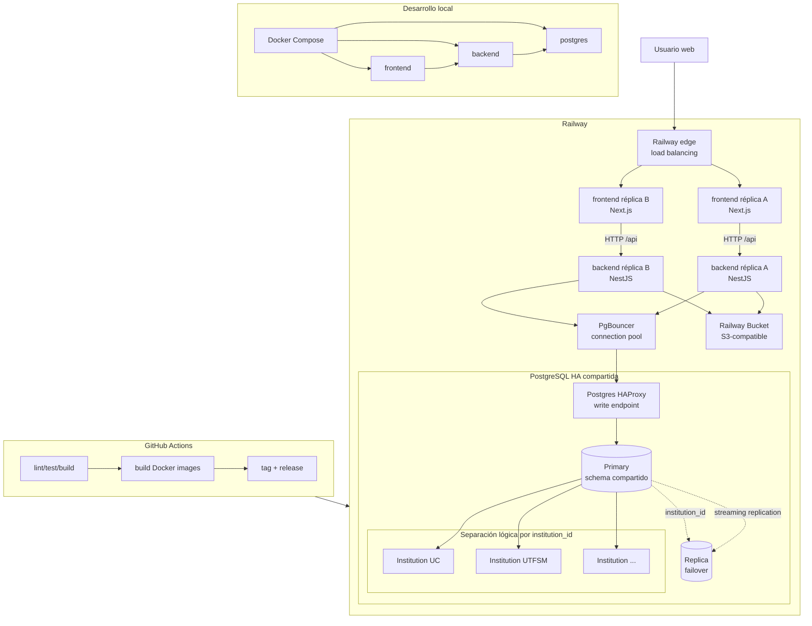

# Arquitectura

## Decisión vigente

AcademiX utiliza una PostgreSQL compartida para todas las Institutions y
aislamiento lógico mediante `institution_id`. Railway es la plataforma de
despliegue elegida para el proyecto. El despliegue objetivo considera réplicas
de aplicación detrás del enrutamiento de Railway, PgBouncer como connection
pool, PostgreSQL HA para failover y Railway Bucket como object storage
S3-compatible para material académico.

La decisión completa y sus trade-offs se registran en
[Adoptar PostgreSQL compartida para multi-tenancy](../../adr/adopt-shared-postgresql-multitenancy.md).

## Vista de alto nivel

```txt
                                  Railway

 Usuarios
    |
    v
 Railway edge / load balancing
    |
    +----------------------+----------------------+
    |                                             |
 frontend réplicas                         backend réplicas
 Next.js                                   NestJS modular
                                                  |
                                                  v
                                           PgBouncer
                                                  |
                                                  v
                                      PostgreSQL HA compartida
                                      primary + replicas
                                                  |
                         +------------------------+------------------------+
                         |                        |                        |
                  Institution UC           Institution UTFSM        Institution ...

 backend réplicas
    |
    v
 Railway Bucket
 material PDF, presentaciones y adjuntos
```

El repositorio demuestra configuraciones Railway separadas para frontend y
backend. El walking skeleton todavía no consume PostgreSQL, por lo que la
provisión del recurso de base y su `DATABASE_URL` pertenecen a la etapa de
persistencia. PgBouncer, PostgreSQL HA y Railway Bucket se declaran como
topología objetivo de despliegue, no como servicios ya consumidos por el
walking skeleton.

### Diagrama arquitectural



El diagrama separa tres preocupaciones: ejecución local reproducible, pipeline
CI/CD y runtime Railway. La base sigue siendo compartida; UC, UTFSM y cualquier
Institution futura se aíslan por `institution_id`, autorización contextual y FK
compuestas. La alta disponibilidad pertenece a la infraestructura: Railway
balancea tráfico entre réplicas de aplicación y PostgreSQL HA enruta conexiones
hacia el primary vigente mediante HAProxy.

## Cambios frente a Entrega 1

La arquitectura de Entrega 1 proponía una solución más pesada: GCP, Cloud Run,
Cloud SQL por tenant, Tenant Registry, object storage, connection pools por
tenant, Redis, workers, read replicas y posibles componentes de gateway o load
balancing. Para Entrega 2 se simplifica intencionalmente el diseño activo del
MVP, incorporando la retroalimentación recibida y reduciendo infraestructura
antes de tener métricas o casos de uso que la consuman.

| Elemento de Entrega 1 | Estado en Entrega 2 | Motivo |
| --- | --- | --- |
| Monorepo Next.js + NestJS | Se mantiene | Sigue siendo suficiente para frontend, backend y documentación versionada. |
| Backend monolito modular | Se mantiene | Permite separar responsabilidades sin introducir microservicios prematuros. |
| GCP, Cloud Run, Cloud SQL y Cloud Storage como plataforma definida | Se reemplaza por Railway, contenedores Docker y Railway Bucket | Railway ya está versionado en el repositorio y reduce carga operacional para el semestre. |
| Base de datos por tenant | Se reemplaza por PostgreSQL compartida con `institution_id` | Evita migraciones, backfills, pools y credenciales por tenant antes de necesitarlos. |
| Tenant Registry central | Se elimina del MVP | El tenant se resuelve como `Institution` desde el path y la base compartida. |
| Connection pool por tenant | Se reemplaza por PgBouncer compartido | No existen múltiples bases; el pool protege la única PostgreSQL compartida frente a muchas conexiones de app. |
| Redis y workers | Se difieren | Solo se incorporan si procesamiento de archivos, notificaciones o recálculos bloquean requests reales. |
| API gateway, reverse proxy y load balancer dedicados | Se reemplazan por el enrutamiento y balanceo gestionado de Railway | La aplicación no administra un gateway propio en el MVP. |
| Read replicas y sub-sharding por tenant | Se reemplazan por PostgreSQL HA compartido para failover; sharding queda diferido | La réplica inicial responde a disponibilidad, no a separación por tenant ni escalamiento analítico. |
| Object storage para binarios | Se incorpora como Railway Bucket S3-compatible | Material PDF, presentaciones y adjuntos no deben almacenarse como binarios en PostgreSQL. |
| Auditoría de registros académicos | Se mantiene | Es requisito central para cambios sensibles y trazabilidad. |
| Separación entre usuario global y pertenencia institucional | Se mantiene simplificada | `User` es global, `InstitutionMembership` habilita acceso institucional y `Enrollment` concentra el rol académico. |
| `CourseMembership` y rol coordinador | Se elimina | El MVP usa docentes con permisos administrativos y estudiantes/ayudantes mediante `Enrollment`. |
| Módulos de assignments, submissions, announcements, regrade, chat, calendar e IA | Se dejan fuera del alcance activo | No pertenecen al flujo priorizado de Entrega 2 o no están comprometidos para el MVP actual. |

La simplificación no elimina las preocupaciones de seguridad ni escalabilidad:
las deja expresadas como decisiones explícitas, trade-offs y evolución futura.
El diseño vigente debe ser robusto en tenant isolation, autorización, auditoría,
desarrollo local, CI/CD y persistencia; no necesita prometer infraestructura
que el producto todavía no usa.

## Despliegue Railway

Componentes comprobables en el repositorio:

- `academix-frontend`: Next.js empaquetado mediante `frontend/Dockerfile`;
- `academix-backend`: NestJS empaquetado mediante `backend/Dockerfile`;
- `frontend/railway.json`: build por Dockerfile y healthcheck `/`;
- `backend/railway.json`: build por Dockerfile y healthcheck `/health`;
- GitHub Actions valida ambas aplicaciones y sus imágenes Docker.

PostgreSQL es una única persistencia compartida del MVP. El backend se conectará
mediante `DATABASE_URL` cuando se implemente la capa de datos. En despliegue
productivo esa variable debe apuntar a PgBouncer; las operaciones que requieran
sesión dedicada, como migraciones, usan una URL no pooleada. No se documentan
credenciales, IDs ni URLs privadas.

Railway puede balancear tráfico público entre réplicas de un servicio. Por eso
el frontend y el backend pueden ejecutarse con al menos dos réplicas cuando se
quiera demostrar tolerancia a caída de una instancia de aplicación.

PostgreSQL HA se declara como configuración objetivo para ambientes no
efímeros: un primary compartido, réplicas de streaming, HAProxy como endpoint
estable y failover automático. La aplicación no decide qué nodo es primary; se
conecta al endpoint expuesto por la infraestructura. Esta réplica no reemplaza
backups ni point-in-time recovery.

Railway es infraestructura de despliegue, no parte del dominio. El código de
negocio depende de HTTP, PostgreSQL y configuración por entorno.

## Escenarios de falla y respuesta

La arquitectura no promete disponibilidad absoluta. Declara qué fallas cubre,
qué fallas quedan delegadas al proveedor y qué acciones operativas son
necesarias para recuperarse.

| Falla | Respuesta esperada | Límite o acción operativa |
| --- | --- | --- |
| Cae una réplica de frontend | Railway mantiene tráfico hacia réplicas sanas. | Requiere ejecutar más de una réplica. Si solo hay una, el servicio queda indisponible hasta restart o redeploy. |
| Cae una réplica de backend | Railway distribuye tráfico hacia réplicas sanas; el backend es stateless. | El backend no debe guardar sesión local ni archivos locales necesarios para continuar una request futura. |
| Cae el proceso completo de backend | Railway aplica healthcheck y restart policy. | Si todas las réplicas fallan por bug de aplicación, se requiere rollback o fix. |
| Aumenta la concurrencia hacia la base | PgBouncer multiplexa conexiones y reduce presión sobre `max_connections`. | PgBouncer no corrige queries lentas ni falta de índices; esas mejoras siguen siendo responsabilidad de diseño de datos. |
| Cae PgBouncer | La aplicación pierde temporalmente el endpoint pooleado. | En HA de Railway, PgBouncer puede escalarse con réplicas; migraciones deben usar URL no pooleada. |
| Cae el primary de PostgreSQL | PostgreSQL HA promueve una réplica y HAProxy enruta hacia el nuevo primary. | Hay una interrupción breve; las conexiones en vuelo se pierden y el cliente debe reintentar. |
| Se corrompen datos o se ejecuta una mala migración | Backups y point-in-time recovery permiten recuperar una versión anterior. | HA no protege contra errores lógicos replicados; se necesitan backups, PITR y pruebas de restore. |
| Cae object storage | La aplicación puede seguir sirviendo flujos que no requieren archivos; descargas o cargas de material fallan temporalmente. | El backend debe responder errores controlados y no perder metadatos si la subida binaria falla. |
| Cae Railway edge o la región/proveedor | Es una falla delegada al proveedor. | El MVP no implementa multi-cloud ni disaster recovery cross-provider; se documenta como riesgo aceptado por alcance. |

La decisión principal es separar alta disponibilidad de aislamiento de datos:
las réplicas de aplicación, PgBouncer y PostgreSQL HA mejoran continuidad
operativa; `institution_id`, autorización, FK y auditoría protegen la separación
entre Institutions.

## Desarrollo local

```txt
Docker Compose
  +-- frontend
  +-- backend
  +-- postgres
  +-- bucket emulator o storage compatible S3 (opcional)
```

El entorno local usa los mismos contenedores de aplicación y una sola
PostgreSQL. No necesita registry, múltiples bases, Redis ni workers. Para
desarrollo de archivos se puede agregar un servicio compatible con S3 o usar un
bucket remoto de desarrollo, siempre manteniendo la misma interfaz de object
storage.

## Backend lógico

```txt
PlatformModule
Authentication
Institution context
  - resolver Institution desde institutionSlug
  - validar Institution activa
  - validar InstitutionMembership activa
  - fijar scope institucional para la operación
CoursesModule
MaterialsModule
QuizzesModule
GradesModule
AuditModule
```

Los nombres representan responsabilidades arquitectónicas, no módulos ya
implementados. El repositorio solo implementa actualmente `PlatformModule` y
`GET /health`.

## Flujo de request

```txt
1. El cliente autentica al User global mediante JWT.
2. Consulta GET /api/v1/institutions para descubrir contextos visibles.
3. Navega a /api/v1/institutions/{institutionSlug}/...
4. El backend valida el JWT y obtiene sub.
5. Resuelve institutionSlug a Institution.id.
6. Si la Institution no existe o no es visible, responde 404.
7. Valida InstitutionMembership activa para User + Institution.
8. Evalúa Enrollment y permisos de la operación.
9. Ejecuta lógica y queries bajo institution_id.
10. Constraints y FK institution-aware rechazan relaciones cruzadas.
11. Cambios sensibles y AuditEvent se confirman en la misma transacción.
```

El slug del path solo solicita un contexto. Nunca autentica ni autoriza.

## Multi-tenancy

`Institution` es la entidad raíz del dominio y tenant lógico. `User` es global;
`InstitutionMembership` responde a qué Institutions puede acceder. Los roles
académicos no se trasladan a esa membership: `Enrollment` concentra los roles
`teacher`, `assistant` y `student` por sección. `teacher` es el rol docente con
permisos administrativos del MVP; no existe rol coordinador ni RBAC completo.

Toda entidad tenant-owned lleva `institution_id`. La estrategia de aislamiento
combina:

1. autenticación global;
2. Institution explícita en el path;
3. InstitutionMembership;
4. autorización académica;
5. scope de aplicación;
6. `institution_id`;
7. FK compuestas y constraints;
8. tests de aislamiento.

RLS queda fuera del MVP y solo puede evaluarse posteriormente como defensa en
profundidad.

## Persistencia

Existe una sola PostgreSQL compartida y un solo schema evolutivo.

- `institutions` contiene UUID, slug, nombre, estado y timestamps;
- `users` contiene identidades globales;
- `institution_memberships` relaciona ambos;
- tablas académicas llevan `institution_id`;
- relaciones tenant-owned incluyen Institution en sus claves declarativas;
- unicidades académicas se scopean por Institution;
- índices parten por `institution_id` cuando responde al acceso real;
- existe una sola secuencia de migraciones;
- los backfills futuros procesan una Institution a la vez cuando corresponda.

PgBouncer se ubica delante de PostgreSQL para multiplexar conexiones de las
réplicas de backend y proteger el límite de conexiones de la base. Las
migraciones y operaciones que requieran una sesión dedicada usan una conexión
no pooleada.

PostgreSQL HA agrega réplicas de streaming y failover automático para reducir
indisponibilidad ante caída del primary. No se usa para partir tenants ni para
lecturas analíticas en el MVP.

Backup y point-in-time recovery cubren la base completa. Restore lógico por
Institution no es una capacidad del MVP.

## Object storage

Material académico binario, como PDFs, presentaciones y adjuntos, se almacena
fuera de PostgreSQL en Railway Bucket, usando interfaz S3-compatible. La base de
datos guarda metadatos, ownership y `storage_key`; el binario vive en object
storage.

El namespace del bucket incluye Institution y recurso académico para evitar
colisiones y facilitar auditoría:

```txt
institutions/{institutionId}/courses/{courseId}/materials/{materialId}/{filename}
```

El acceso a archivos privados se media por backend o URLs firmadas de vida
corta. El cliente no recibe credenciales del bucket.

## Seguridad inicial

- `GET /health` es público y no consulta contexto institucional.
- La API académica exige JWT; `sub` identifica al User global.
- Institution, recursos y relaciones se resuelven dentro del mismo scope.
- Instituciones o recursos no visibles responden `404`.
- Falta de rol sobre un recurso visible responde `403`.
- Requests no aceptan `institution_id`, actor, puntajes ni otros campos
  sensibles derivados por el servidor.
- Auditoría excluye tokens, credenciales, claves internas y pautas.

## CI/CD

CI instala dependencias, ejecuta lint, test/build y construye imágenes Docker
para frontend y backend. Railway usa las configuraciones versionadas de cada
aplicación para build, healthcheck y restart policy. Releases se generan desde
tags semánticos mediante GitHub Actions.

## Evolución

La arquitectura utiliza una PostgreSQL compartida con aislamiento lógico por
Institution, PgBouncer para pooling y PostgreSQL HA para failover. Estrategias
de particionamiento, read scaling o sharding podrán evaluarse en el futuro
únicamente si métricas reales de volumen, latencia o carga operacional lo
justifican. No se diseñan routers ni shards en el MVP.

Cassandra u otro motor distribuido no forman parte de la solución actual. Ese
tipo de cambio solo tendría sentido frente a patrones de acceso y volumen que
PostgreSQL no pueda resolver con índices, particionamiento o sharding futuro.
