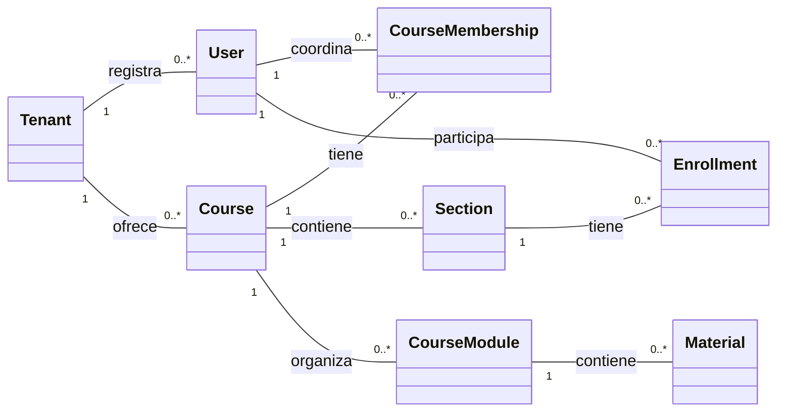
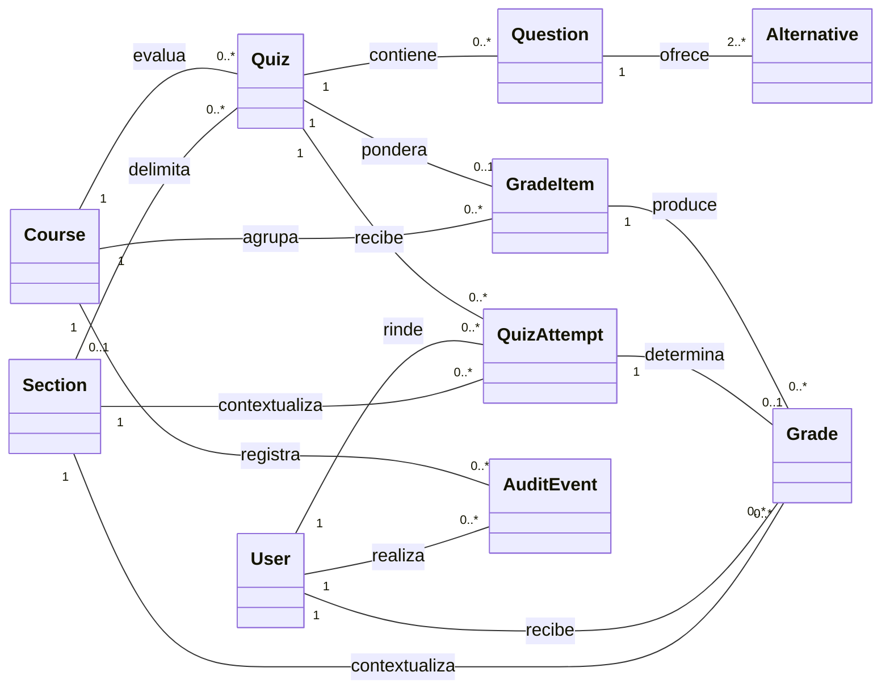

# Modelo de dominio en UML

La pauta de Entrega 2 pide representar los conceptos fundamentales mediante
el formato de un **diagrama de clases UML**. Las clases de abajo son conceptos
del problema, no tablas ni clases definitivas de implementación. Se divide el
mismo modelo en dos vistas para que las multiplicidades sean legibles en una
presentación. Las reglas se desarrollan en el
[modelo de dominio](05-domain-model.md) y su persistencia en el
[modelo de datos](06-data-model.md).

## Contexto académico y contenido

`CourseMembership` expresa la coordinación de curso. `Enrollment` expresa
los roles `teacher`, `assistant` y `student` por sección; una persona puede
tener varios roles activos, incluso dentro de la misma sección. Las
asociaciones con `Tenant` son conceptuales: el registry y los datos
académicos viven en bases de datos separadas.

## Evaluaciones, notas y trazabilidad

Un `Quiz` puede ser para todo el curso o para una sección. Cada intento
conserva la sección donde se inició. `Grade` representa la nota vigente,
determinada por el último intento calificado y publicada explícitamente.
`Alternative` es un concepto anidado en la pregunta, aunque se persista como
JSONB. `AuditEvent` registra cambios académicos dentro del tenant.
