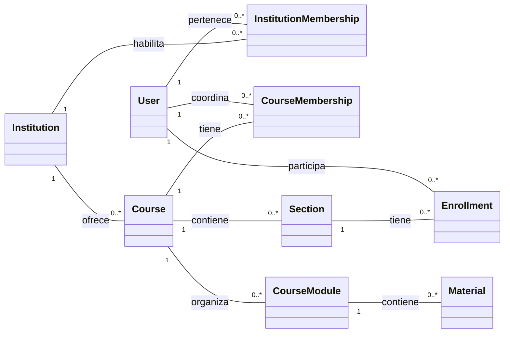
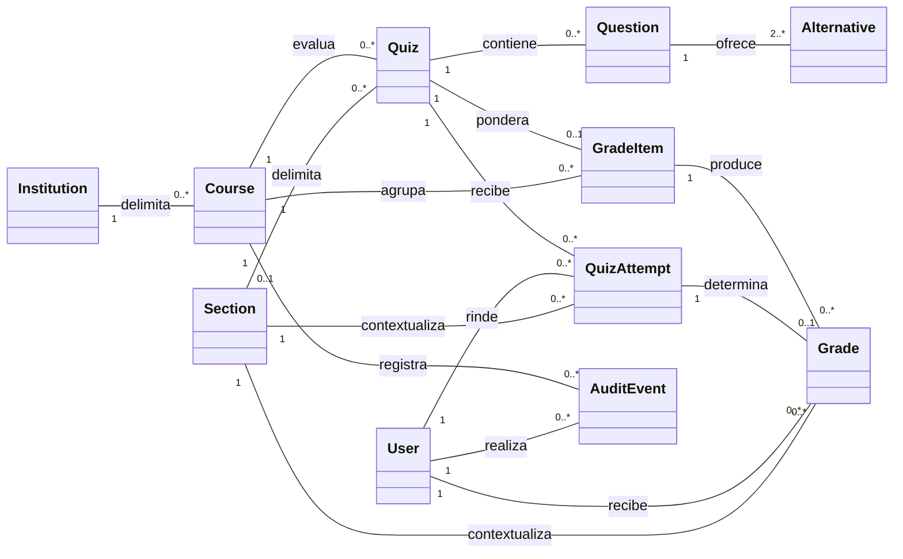

# Modelo de dominio en UML

La pauta de Entrega 2 pide representar los conceptos fundamentales mediante un
diagrama de clases. Las clases siguientes son conceptos del problema, no clases
definitivas de implementación. El modelo se divide para mantener legibilidad.

## Identidad, institución y contenido

`User` es global. `InstitutionMembership` habilita el acceso base, mientras
CourseMembership y Enrollment conservan los roles académicos contextuales.
Todas las clases académicas son tenant-owned por una Institution aunque el
diagrama omita relaciones repetidas para evitar ruido visual.

## Evaluaciones, notas y trazabilidad

Quiz, Question, QuizAttempt, GradeItem, Grade y AuditEvent conservan
`institution_id`. Las FK compuestas comprueban que las relaciones del diagrama
pertenecen a la misma Institution. Alternative continúa como concepto anidado en
Question aunque se persista como JSONB.
