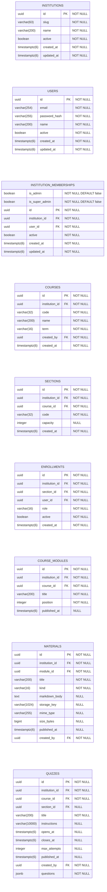

# Modelo relacional: ERD 1

```mermaid
erDiagram
  direction LR
  INSTITUTIONS {
    uuid id PK "NOT NULL"
    varchar(63) slug "NOT NULL"
    varchar(200) name "NOT NULL"
    boolean active "NOT NULL"
    timestamptz(6) created_at "NOT NULL"
    timestamptz(6) updated_at "NOT NULL"
  }

  USERS {
    uuid id PK "NOT NULL"
    varchar(254) email "NOT NULL"
    varchar(255) password_hash "NOT NULL"
    varchar(200) name "NOT NULL"
    boolean active "NOT NULL"
    timestamptz(6) created_at "NOT NULL"
    timestamptz(6) updated_at "NOT NULL"
  }

  INSTITUTION_MEMBERSHIPS {
    boolean is_admin "NOT NULL DEFAULT false"
    boolean is_super_admin "NOT NULL DEFAULT false"
    uuid id PK "NOT NULL"
    uuid institution_id FK "NOT NULL"
    uuid user_id FK "NOT NULL"
    boolean active "NOT NULL"
    timestamptz(6) created_at "NOT NULL"
    timestamptz(6) updated_at "NOT NULL"
  }

  COURSES {
    uuid id PK "NOT NULL"
    uuid institution_id FK "NOT NULL"
    varchar(32) code "NOT NULL"
    varchar(200) name "NOT NULL"
    varchar(16) term "NOT NULL"
    uuid created_by FK "NOT NULL"
    timestamptz(6) created_at "NOT NULL"
  }

  SECTIONS {
    uuid id PK "NOT NULL"
    uuid institution_id FK "NOT NULL"
    uuid course_id FK "NOT NULL"
    varchar(32) code "NOT NULL"
    integer capacity "NULL"
    timestamptz(6) created_at "NOT NULL"
  }

  ENROLLMENTS {
    uuid id PK "NOT NULL"
    uuid institution_id FK "NOT NULL"
    uuid section_id FK "NOT NULL"
    uuid user_id FK "NOT NULL"
    varchar(16) role "NOT NULL"
    boolean active "NOT NULL"
    timestamptz(6) created_at "NOT NULL"
  }

  COURSE_MODULES {
    uuid id PK "NOT NULL"
    uuid institution_id FK "NOT NULL"
    uuid course_id FK "NOT NULL"
    varchar(200) title "NOT NULL"
    integer position "NOT NULL"
    timestamptz(6) published_at "NULL"
  }

  MATERIALS {
    uuid id PK "NOT NULL"
    uuid institution_id FK "NOT NULL"
    uuid module_id FK "NOT NULL"
    varchar(200) title "NOT NULL"
    varchar(16) kind "NOT NULL"
    text markdown_body "NULL"
    varchar(1024) storage_key "NULL"
    varchar(255) mime_type "NULL"
    bigint size_bytes "NULL"
    timestamptz(6) published_at "NULL"
    uuid created_by FK "NOT NULL"
  }

  QUIZZES {
    uuid id PK "NOT NULL"
    uuid institution_id FK "NOT NULL"
    uuid course_id FK "NOT NULL"
    uuid section_id FK "NULL"
    varchar(200) title "NOT NULL"
    varchar(10000) instructions "NULL"
    timestamptz(6) opens_at "NULL"
    timestamptz(6) closes_at "NULL"
    integer max_attempts "NULL"
    timestamptz(6) published_at "NULL"
    uuid created_by FK "NOT NULL"
    jsonb questions "NOT NULL"
  }
```
