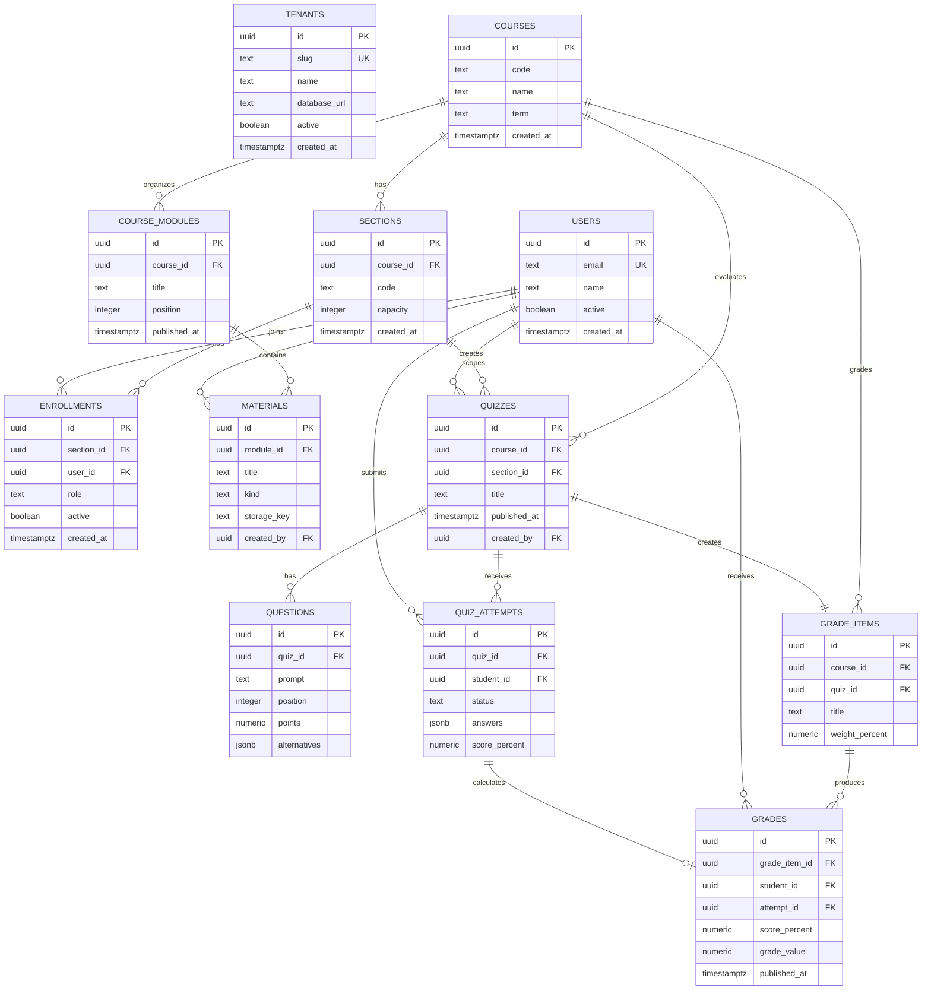

# Modelo de datos

AcademiX usa sharding por universidad: una DB central de registry y una DB por
tenant. Las DB `academix_uc_db` y `academix_utfsm_db` comparten exactamente el
mismo schema.

## Registry DB

### tenants

Registra universidades y permite resolver la conexión del tenant.

| Campo | Tipo | Regla |
| --- | --- | --- |
| id | uuid | PK |
| slug | text | único, requerido. Ej: `uc`, `utfsm` |
| name | text | requerido |
| database_url | text | requerido, secreto operacional |
| active | boolean | requerido, default true |
| created_at | timestamptz | requerido |

Constraints e índices: `unique (slug)`, `index (active)`.

## Tenant DB

No se agrega `tenant_id` a cada tabla: el límite del tenant es la base de datos.
El backend debe elegir la conexión correcta antes de consultar.

### users

Personas dentro de una universidad.

Campos: `id uuid PK`, `email text`, `name text`, `active boolean`,
`created_at timestamptz`.

Reglas: `unique (email)`. Un usuario puede tener roles distintos mediante
`enrollments`.

### courses

Ramos, como "Ingeniería de Software", sigla `DDAA12`.

Campos: `id uuid PK`, `code text`, `name text`, `term text`,
`created_at timestamptz`.

Regla: `unique (code, term)`.

### sections

Paralelos/secciones de un curso.

Campos: `id uuid PK`, `course_id uuid FK`, `code text`, `capacity integer`,
`created_at timestamptz`.

Reglas: `unique (course_id, code)`, `capacity >= 0` cuando exista.

### enrollments

Vínculo usuario-sección-rol. Reemplaza RBAC complejo.

Campos: `id uuid PK`, `section_id uuid FK`, `user_id uuid FK`, `role text`,
`active boolean`, `created_at timestamptz`.

Reglas:

- `role in ('teacher', 'student', 'assistant')`.
- `unique (section_id, user_id, role)`.
- Índices: `(user_id, active)` y `(section_id, role, active)`.

### course_modules

Organiza contenido del curso.

Campos: `id uuid PK`, `course_id uuid FK`, `title text`, `position integer`,
`published_at timestamptz`.

Reglas: `unique (course_id, position)`. Estudiantes solo ven módulos publicados.

### materials

Markdown o archivo publicado en un módulo.

Campos: `id uuid PK`, `module_id uuid FK`, `title text`, `kind text`,
`markdown_body text`, `storage_key text`, `mime_type text`, `size_bytes bigint`,
`published_at timestamptz`, `created_by uuid FK`.

Reglas:

- `kind in ('markdown', 'file')`.
- Si `kind='markdown'`, `markdown_body` es requerido.
- Si `kind='file'`, `storage_key`, `mime_type` y `size_bytes` son requeridos.
- MIME permitido: PDF, CSV, XLSX, TXT, JPEG, PNG.

### quizzes

Evaluaciones tipo cuestionario.

Campos: `id uuid PK`, `course_id uuid FK`, `section_id uuid FK nullable`,
`title text`, `instructions text`, `opens_at timestamptz`,
`closes_at timestamptz`, `published_at timestamptz`, `created_by uuid FK`.

Reglas: `section_id null` aplica al curso completo. Solo docentes del curso
pueden crear/publicar.

### questions

Preguntas del cuestionario.

Campos: `id uuid PK`, `quiz_id uuid FK`, `prompt text`, `position integer`,
`points numeric(6,2)`, `alternatives jsonb`.

Ejemplo `alternatives`:

```json
[
  { "id": "a", "text": "Opción A", "is_correct": false },
  { "id": "b", "text": "Opción B", "is_correct": true }
]
```

Reglas:

- `unique (quiz_id, position)`.
- `points > 0`.
- Cada pregunta debe tener al menos dos alternativas.
- Cada pregunta debe tener exactamente una alternativa correcta.
- La estructura de `alternatives` se valida al publicar el quiz.

### quiz_attempts

Intento de un estudiante.

Campos: `id uuid PK`, `quiz_id uuid FK`, `student_id uuid FK`, `status text`,
`started_at timestamptz`, `submitted_at timestamptz`,
`answers jsonb`, `score_points numeric(8,2)`, `score_percent numeric(5,2)`.

Ejemplo `answers`:

```json
[
  {
    "question_id": "uuid",
    "selected_alternative_id": "b",
    "is_correct": true,
    "points_awarded": 1
  }
]
```

Reglas:

- `status in ('in_progress', 'submitted', 'graded')`.
- Un intento activo por estudiante y quiz en el MVP.
- `score_percent between 0 and 100` cuando exista.
- `answers` guarda snapshot de respuestas y corrección al enviar.

### grade_items

Evaluaciones ponderadas dentro del libro de notas.

Campos: `id uuid PK`, `course_id uuid FK`, `quiz_id uuid FK`, `title text`,
`weight_percent numeric(5,2)`, `created_at timestamptz`.

Reglas: `unique (quiz_id)`, `weight_percent >= 0`. La suma por curso se valida
antes de publicar configuración final.

### grades

Nota calculada/publicada.

Campos: `id uuid PK`, `grade_item_id uuid FK`, `student_id uuid FK`,
`attempt_id uuid FK nullable`, `score_percent numeric(5,2)`,
`grade_value numeric(3,1)`, `published_at timestamptz`,
`created_at timestamptz`, `updated_at timestamptz`.

Reglas:

- `unique (grade_item_id, student_id)`.
- `score_percent between 0 and 100`.
- `grade_value between 1.0 and 7.0`.
- Índices: `(student_id, published_at)` y `(grade_item_id)`.

## Transacciones críticas

- Finalizar quiz: guardar `answers`, calcular puntaje, cerrar intento y crear
  `grade` en una transacción.
- Publicar notas: actualizar `published_at` del conjunto de grades en una
  transacción.
- Cambiar ponderaciones: validar suma y persistir cambios juntos.

## Migraciones

- Registry y tenant DB tienen migraciones separadas.
- Cada migración de tenant debe ejecutarse en `academix_uc_db`,
  `academix_utfsm_db` y toda DB futura.

## ERD Mermaid


