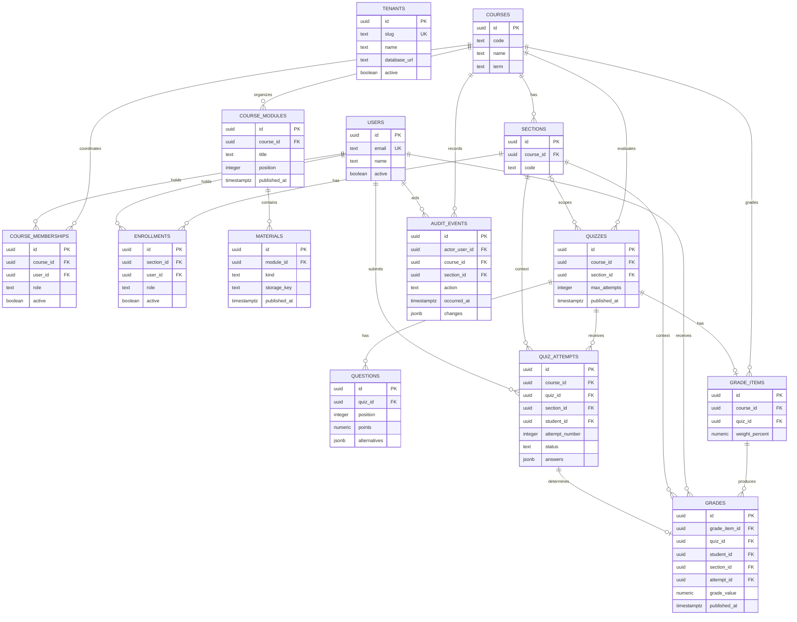

# Modelo de datos

AcademiX usa sharding por universidad: una DB central de registry y una DB por
tenant. Las DB `academix_uc_db` y `academix_utfsm_db` comparten el mismo
schema. Las tablas académicas no llevan `tenant_id`: la DB elegida antes de
consultar es el límite del tenant.

En las tablas siguientes, las FK y campos de identidad/relación son `NOT NULL`
salvo donde se indica `nullable`. Las verificaciones de permisos usan JWT y
pertenencias activas de la DB del tenant; `x-tenant` solo selecciona la DB.

## Registry DB

### tenants

| Campo | Tipo | Regla |
| --- | --- | --- |
| id | uuid | PK |
| slug | text | único, requerido. Ej: `uc`, `utfsm` |
| name | text | requerido |
| database_url | text | requerido, secreto operacional |
| active | boolean | requerido, default true |
| created_at | timestamptz | requerido |

`unique (slug)` permite resolver el tenant. No se expone `database_url` en la
API, eventos ni logs.

## Tenant DB

### users

Personas de una universidad. `id` coincide con el `sub` del JWT para ese
tenant; la identidad no se toma del body de un request académico.

Campos: `id uuid PK`, `email text`, `name text`, `active boolean`,
`created_at timestamptz`.

Reglas: `unique (email)`. La autorización requiere `active = true` y una
pertenencia activa con el alcance apropiado.

### courses

Ramos semestrales concretos.

Campos: `id uuid PK`, `code text`, `name text`, `term text`,
`created_at timestamptz`.

Regla: `unique (code, term)`.

### course_memberships

Coordinadores de curso. Se separan de los roles de sección para que un docente
de un paralelo no administre automáticamente todo el curso.

Campos: `id uuid PK`, `course_id uuid FK`, `user_id uuid FK`,
`role text`, `active boolean`, `created_at timestamptz`.

Reglas: `role = 'coordinator'`; un índice único parcial en
`(course_id, user_id, role) WHERE active` evita duplicar la misma pertenencia
activa. Un curso puede tener varios coordinadores. El alta del curso y su
primera pertenencia de coordinador se realizan atómicamente durante el
aprovisionamiento inicial.

### sections

Paralelos de un curso.

Campos: `id uuid PK`, `course_id uuid FK`, `code text`,
`capacity integer nullable`, `created_at timestamptz`.

Reglas: `unique (course_id, code)`, `capacity >= 0` cuando exista. La clave
`(id, course_id)` también es única para FK compuestas de alcance.

### enrollments

Una fila por rol asignado a un usuario en una sección. Una persona puede
tener `teacher` y `student` activos en la misma sección, además de roles
distintos en otras secciones.

Campos: `id uuid PK`, `section_id uuid FK`, `user_id uuid FK`,
`role text`, `active boolean`, `created_at timestamptz`.

Reglas:

- `role in ('teacher', 'student', 'assistant')`.
- Índice único parcial `(section_id, user_id, role) WHERE active`: impide
  duplicar un mismo rol activo, pero permite varios roles diferentes.
- Índices de consulta `(user_id, active)` y
  `(section_id, role, active)`.
- Desactivar o cambiar una asignación no borra su historial: genera
  `audit_events` con el valor anterior y el nuevo.

### course_modules

Campos: `id uuid PK`, `course_id uuid FK`, `title text`,
`position integer`, `published_at timestamptz nullable`.

Regla: `unique (course_id, position)`. Estudiantes ven solo módulos
publicados de cursos donde tienen inscripción estudiantil activa.

### materials

Markdown o referencia a archivo en object storage.

Campos: `id uuid PK`, `module_id uuid FK`, `title text`, `kind text`,
`markdown_body text nullable`, `storage_key text nullable`,
`mime_type text nullable`, `size_bytes bigint nullable`,
`published_at timestamptz nullable`, `created_by uuid FK`.

Reglas:

- `kind in ('markdown', 'file')`.
- `markdown` exige `markdown_body` y no usa campos de archivo.
- `file` exige `storage_key`, MIME permitido y `size_bytes >= 0`.
- MIME permitidos: PDF, CSV, XLSX, TXT, JPEG y PNG.
- Un material es visible para estudiantes solo si él y su módulo están
  publicados. El binario se entrega tras comprobar tenant y matrícula.

### quizzes

Evaluaciones de alternativas. `section_id = null` significa alcance de
curso; otro valor limita el quiz a esa sección.

Campos: `id uuid PK`, `course_id uuid FK`,
`section_id uuid nullable`, `title text`, `instructions text nullable`,
`opens_at timestamptz nullable`, `closes_at timestamptz nullable`,
`max_attempts integer nullable`, `published_at timestamptz nullable`,
`created_by uuid FK`.

Reglas:

- `max_attempts IS NULL OR max_attempts > 0`; su default es `null` y
  permite intentos ilimitados. Un límite cuenta todos los intentos iniciados.
- Si hay `section_id`, FK compuesta `(section_id, course_id)` referencia
  `sections(id, course_id)`.
- `opens_at < closes_at` cuando ambos existen.
- La clave `(id, course_id)` es única para FK compuestas posteriores.
- Coordinador crea quizzes de curso; docente puede crear los de sus secciones.
  Publicar exige pauta válida. Después del primer intento se inmovilizan
  preguntas, alternativas, puntajes y política de intentos.

### questions

Campos: `id uuid PK`, `quiz_id uuid FK`, `prompt text`,
`position integer`, `points numeric(6,2)`, `alternatives jsonb`.

Ejemplo de `alternatives`:

```json
[
  { "id": "a", "text": "Opción A", "is_correct": false },
  { "id": "b", "text": "Opción B", "is_correct": true }
]
```

Reglas:

- `unique (quiz_id, position)` y `points > 0`.
- El JSON debe ser un arreglo con al menos dos alternativas; cada una tiene
  `id` y `text` no vacíos, los `id` son únicos dentro de la pregunta y
  exactamente una alternativa tiene `is_correct = true`.
- La validación completa se ejecuta antes de publicar y al guardar cambios.
  El backend nunca serializa `is_correct` en la vista estudiantil ni incluye
  la pauta en auditoría o logs.
- No se editan ni eliminan preguntas después de iniciado el primer intento.

### quiz_attempts

Intentos de estudiante. `section_id` es un snapshot inmutable de la sección
desde la que se inició el intento; `course_id` permite imponer FK compuestas
de alcance.

Campos: `id uuid PK`, `course_id uuid FK`, `quiz_id uuid FK`,
`section_id uuid FK`, `student_id uuid FK`, `attempt_number integer`,
`status text`, `started_at timestamptz`,
`submitted_at timestamptz nullable`, `answers jsonb`,
`score_points numeric(8,2) nullable`,
`score_percent numeric(5,2) nullable`.

Ejemplo del snapshot académico de `answers`:

```json
[
  {
    "question_id": "uuid",
    "selected_alternative_id": "b",
    "is_correct": true,
    "points_awarded": 1
  }
]
```

Reglas:

- `status in ('in_progress', 'submitted', 'graded')` y
  `attempt_number > 0`.
- FK `(quiz_id, course_id) -> quizzes(id, course_id)` y
  `(section_id, course_id) -> sections(id, course_id)`.
- `unique (quiz_id, student_id, attempt_number)`; la clave
  `(id, quiz_id, student_id, section_id)` también es única para la FK
  compuesta de `grades`.
- Índice único parcial `(quiz_id, student_id) WHERE status = 'in_progress'`.
  El número siguiente se asigna en transacción con bloqueo de la serie por
  estudiante y quiz, para evitar dos inicios concurrentes.
- Se valida matrícula `student` activa en `section_id`, alcance del quiz,
  ventana temporal, límite `max_attempts` y ausencia de nota ya publicada.
  Si el usuario puede acceder a la pauta de ese quiz como coordinador o docente,
  se rechaza el inicio aunque también tenga rol `student`.
- `score_percent between 0 and 100` cuando exista. Al pasar a `graded`,
  `submitted_at`, respuestas y puntaje son requeridos e inmutables.
- `is_correct` y `points_awarded` los calcula el servidor; no se aceptan
  desde el cliente. La API estudiantil solo devuelve la selección y omite
  porcentaje y nota antes de la publicación.

### grade_items

Evaluaciones ponderadas. En el MVP cada ítem se vincula a un quiz.

Campos: `id uuid PK`, `course_id uuid FK`, `quiz_id uuid FK`,
`title text`, `weight_percent numeric(5,2)`,
`created_at timestamptz`.

Reglas:

- `unique (quiz_id)`; FK compuesta `(quiz_id, course_id)` referencia
  `quizzes(id, course_id)`; `(id, quiz_id)` es clave única para notas.
- `weight_percent between 0 and 100`, con default 0 al crear el ítem
  junto al quiz.
- La operación que reemplaza el conjunto completo de ponderaciones de un
  curso exige suma exacta de 100 % y es atómica.
- Todos los ítems del curso deben existir y sus pesos sumar 100 % antes de
  la primera publicación de notas. Tras publicar cualquier nota del curso se
  bloquean altas de ítems y cambios de ponderaciones. Así el promedio publicado permanece estable.

### grades

Nota vigente por estudiante e ítem. `section_id` conserva el contexto del
último intento que la determinó. `quiz_id` repite la referencia del ítem para
poder comprobar por FK que el intento y el ítem corresponden al mismo quiz.

Campos: `id uuid PK`, `grade_item_id uuid FK`, `quiz_id uuid FK`,
`student_id uuid FK`, `section_id uuid FK`, `attempt_id uuid FK`,
`score_percent numeric(5,2)`, `grade_value numeric(3,1)`,
`published_at timestamptz nullable`, `created_at timestamptz`,
`updated_at timestamptz`.

Reglas:

- `unique (grade_item_id, student_id)`: una nota vigente por estudiante e
  ítem. El último intento `graded` según `attempt_number` la determina,
  aunque el estudiante haya cambiado de sección.
- FK compuesta `(grade_item_id, quiz_id) -> grade_items(id, quiz_id)` y
  `(attempt_id, quiz_id, student_id, section_id) ->
  quiz_attempts(id, quiz_id, student_id, section_id)`; el intento debe estar
  `graded` (validación transaccional). El intento referenciado es obligatorio.
- `score_percent between 0 and 100`;
  `grade_value between 1.0 and 7.0` a un decimal.
- Índice `(student_id, published_at)` para la vista propia; el índice de la
  FK/único de `grade_item_id` sirve al libro de notas.
- Mientras `published_at IS NULL`, un intento calificado más reciente
  actualiza la nota vigente y deja un `audit_event`. Si ya fue publicada,
  el valor, porcentaje, sección, intento y `published_at` son inmutables.
  Se impiden nuevos intentos de ese estudiante para ese quiz.
- Solo coordinador del curso o docente autorizado para `section_id` puede
  publicar. La publicación no sobrescribe una nota publicada.

## Cálculo del libro de notas

1. `score_percent = 100 * score_points / sum(question.points)`. Se almacena
   con dos decimales y redondeo `HALF_UP`; el total de puntos debe ser mayor
   que cero.
2. Para `score_percent <= 60`,
   `grade_value = 1 + score_percent * 3 / 60`. Para un porcentaje mayor,
   `grade_value = 4 + (score_percent - 60) * 3 / 40`. Se redondea a un decimal
   con `HALF_UP`.
3. El promedio parcial usa solo notas con `grades.published_at IS NOT NULL`:
   `sum(grade_value * weight_percent) / sum(weight_percent)`, redondeado a
   un decimal con `HALF_UP`. Si la suma de ponderaciones publicadas es cero,
   el promedio es `null`. Se informa además esa suma y si es menor que 100 %.
4. El promedio se calcula en backend; no se almacena como columna derivada.
   La vista estudiantil no incluye notas ni puntajes no publicados.

## audit_events

Historial académico inmutable dentro de la DB del tenant.

Campos: `id uuid PK`, `actor_user_id uuid FK`, `action text`,
`resource_type text`, `resource_id uuid`, `course_id uuid FK`,
`section_id uuid FK nullable`, `occurred_at timestamptz`,
`changes jsonb` con `before` y `after` sanitizados.

Reglas:

- Solo la capa de dominio inserta eventos; permisos de DB o un trigger
  impiden actualización y borrado, también fuera de la API. Índice
  `(course_id, occurred_at DESC)` para consultar el historial del curso.
- El actor se deriva del JWT. `section_id`, si existe, pertenece a
  `course_id` mediante FK compuesta. `resource_id` es polimórfico y su
  existencia se valida en la operación de dominio.
- Se registran al menos cambios de coordinadores y roles, publicación o
  modificación de material y quizzes, ponderaciones, sustitución de nota
  no publicada y publicación de notas.
- `changes` excluye JWT, URLs de DB, `storage_key`, respuestas correctas y
  otros secretos. Evento y cambio académico se confirman en la misma
  transacción.

## Transacciones críticas

- Iniciar intento: bloquear la serie `(quiz_id, student_id)`, validar
  `max_attempts`, matrícula, acceso a pauta y publicación, asignar
  `attempt_number`.
- Finalizar intento: inmovilizar respuestas, calcular porcentaje y nota,
  marcar intento `graded`, crear o actualizar la nota no publicada desde ese
  último intento y registrar auditoría en una transacción. Un reenvío
  idempotente no duplica resultados.
- Publicar notas: bloquear las notas seleccionadas, verificar alcance del
  actor, intentos calificados, ausencia de intentos `in_progress` para esos
  estudiantes y quizzes, y ponderaciones del curso que sumen 100 %; actualizar `published_at` y escribir eventos en una
  transacción. No se sobrescriben notas publicadas.
- Cambiar ponderaciones: bloquear el libro del curso, validar suma 100 % y
  ausencia de notas publicadas, persistir todo y registrar auditoría en una
  transacción.

## Migraciones

- Registry y tenant DB tienen migraciones separadas.
- Cada migración de tenant se ejecuta en `academix_uc_db`,
  `academix_utfsm_db` y toda DB futura.
- El aprovisionamiento de cada curso inserta su primer `course_membership`
  coordinador de forma atómica. El mecanismo de identidad JWT debe garantizar
  que `sub` corresponde al `users.id` del tenant activo.

## ERD Mermaid

El registry está en una DB distinta; su entidad se dibuja sin FK hacia las
tablas académicas.


