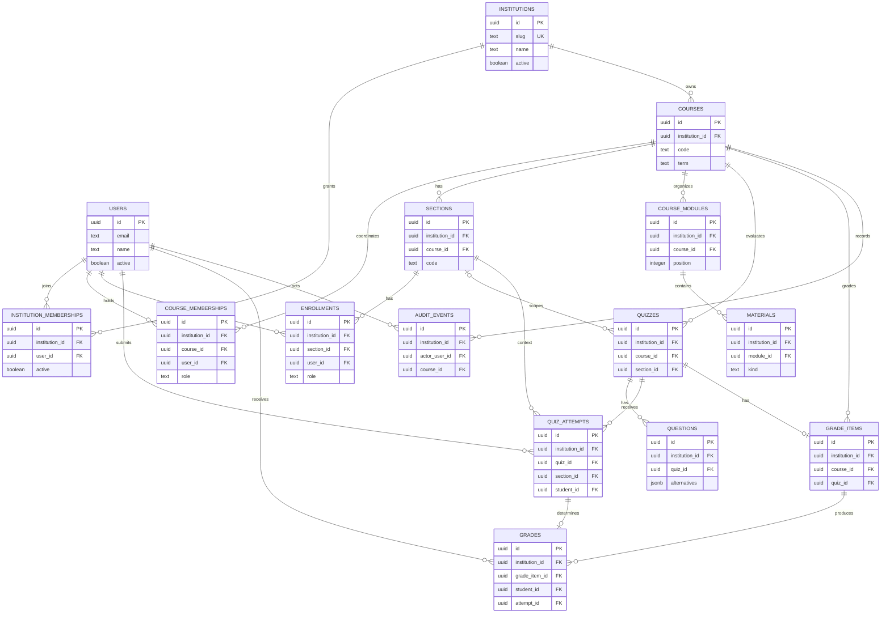

# Modelo de datos

AcademiX utiliza una PostgreSQL compartida. `institutions.id` es la raíz del
tenant lógico y `institution_id` aparece en toda tabla académica tenant-owned.
`users` es global; `institution_memberships` relaciona identidades con las
Institutions a las que pueden acceder.

Este es un modelo lógico. El repositorio todavía no elige ORM, herramienta de
migraciones ni DDL ejecutable.

## Principios transversales

- UUID es la PK interna de Institution y de los recursos del dominio.
- `institutions.slug` es globalmente único y legible, pero no se usa como FK.
- Toda tabla tenant-owned declara `institution_id NOT NULL`.
- Cada tabla tenant-owned expone una clave candidata
  `unique (institution_id, id)` para relaciones compuestas.
- Las FK entre tablas tenant-owned incluyen `institution_id`.
- Las FK hacia User comprueban la pareja `(institution_id, user_id)` contra
  `institution_memberships` cuando la relación exige pertenencia institucional.
- Las unicidades académicas incluyen Institution cuando otras Institutions
  pueden reutilizar el mismo valor.
- Los índices comienzan por `institution_id` cuando el acceso real está scoped
  por Institution o respalda una FK/constraint compuesta.
- RLS no forma parte del MVP.

## Entidades globales e institucionales

### institutions

Raíz de cada tenant lógico.

| Campo | Tipo | Regla |
| --- | --- | --- |
| id | uuid | PK, globalmente único |
| slug | text | único global, requerido |
| name | text | requerido |
| active | boolean | requerido, default true |
| created_at | timestamptz | requerido |
| updated_at | timestamptz | requerido |

UC y UTFSM usan los slugs `uc` y `utfsm` en la misma tabla. Su bootstrap futuro
será idempotente y separado de las migraciones.

### users

Identidades globales. El `sub` del JWT resuelve `users.id`; no se toma una
identidad desde el body de un request académico.

Campos: `id uuid PK`, `email text`, `name text`, `active boolean`,
`created_at timestamptz`, `updated_at timestamptz`.

El modelo actual autentica por `sub`, no por email. Por eso esta revisión no
introduce una nueva promesa de unicidad global de email; deberá alinearse con el
proveedor de identidad cuando se diseñe autenticación.

### institution_memberships

Pertenencia base de un User a una Institution. No almacena roles académicos.

Campos: `id uuid PK`, `institution_id uuid FK`, `user_id uuid FK`,
`active boolean`, `created_at timestamptz`, `updated_at timestamptz`.

Reglas:

- `unique (institution_id, user_id)` mantiene una relación estable que puede
  activarse o desactivarse sin duplicarla;
- `(institution_id, id)` es único para referencias institution-aware;
- índice `(user_id, active, institution_id)` para listar Institutions visibles;
- toda operación académica exige membership activa;
- cambios de estado generan AuditEvent cuando exista un contexto académico que
  corresponda auditar.

## Entidades tenant-owned

### courses

Ramos semestrales concretos.

Campos: `id uuid PK`, `institution_id uuid FK`, `code text`, `name text`,
`term text`, `created_at timestamptz`.

Reglas:

- `unique (institution_id, code, term)`;
- `unique (institution_id, id)`;
- índice `(institution_id, term, code)` para listados institucionales.

### course_memberships

Coordinadores de Course.

Campos: `id uuid PK`, `institution_id uuid`, `course_id uuid`, `user_id uuid`,
`role text`, `active boolean`, `created_at timestamptz`.

Reglas:

- `role = 'coordinator'`;
- FK `(institution_id, course_id)` referencia Course;
- FK `(institution_id, user_id)` referencia InstitutionMembership;
- único parcial
  `(institution_id, course_id, user_id, role) WHERE active`;
- índice `(institution_id, user_id, active)` para cursos visibles;
- crear Course y su primera membership coordinadora es atómico.

### sections

Campos: `id uuid PK`, `institution_id uuid`, `course_id uuid`, `code text`,
`capacity integer nullable`, `created_at timestamptz`.

Reglas:

- FK `(institution_id, course_id)` referencia Course;
- `unique (institution_id, course_id, code)`;
- `capacity >= 0` cuando exista;
- `(institution_id, id, course_id)` es único para relaciones que también
  comprueban el Course.

### enrollments

Una fila por rol de User en Section.

Campos: `id uuid PK`, `institution_id uuid`, `section_id uuid`,
`user_id uuid`, `role text`, `active boolean`, `created_at timestamptz`.

Reglas:

- `role in ('teacher', 'student', 'assistant')`;
- FK `(institution_id, section_id)` referencia Section;
- FK `(institution_id, user_id)` referencia InstitutionMembership;
- único parcial
  `(institution_id, section_id, user_id, role) WHERE active`;
- índices `(institution_id, user_id, active)` y
  `(institution_id, section_id, role, active)`;
- desactivar o cambiar un rol no elimina su evidencia histórica y genera
  auditoría.

### course_modules

Campos: `id uuid PK`, `institution_id uuid`, `course_id uuid`, `title text`,
`position integer`, `published_at timestamptz nullable`.

Reglas:

- FK `(institution_id, course_id)` referencia Course;
- `unique (institution_id, course_id, position)`;
- estudiantes ven solo módulos publicados de cursos autorizados.

### materials

Markdown o metadatos de un archivo externo.

Campos: `id uuid PK`, `institution_id uuid`, `module_id uuid`, `title text`,
`kind text`, `markdown_body text nullable`, `storage_key text nullable`,
`mime_type text nullable`, `size_bytes bigint nullable`,
`published_at timestamptz nullable`, `created_by uuid`.

Reglas:

- FK `(institution_id, module_id)` referencia CourseModule;
- FK `(institution_id, created_by)` referencia InstitutionMembership;
- `kind in ('markdown', 'file')`;
- markdown exige cuerpo y excluye campos de archivo;
- file exige metadatos, MIME permitido y `size_bytes >= 0`;
- el futuro `storage_key` usa namespace interno por Institution, no se expone a
  clientes ni auditoría;
- el backend valida InstitutionMembership y matrícula antes de servir contenido.

### quizzes

Quiz de Course o de una Section del mismo Course.

Campos: `id uuid PK`, `institution_id uuid`, `course_id uuid`,
`section_id uuid nullable`, `title text`, `instructions text nullable`,
`opens_at timestamptz nullable`, `closes_at timestamptz nullable`,
`max_attempts integer nullable`, `published_at timestamptz nullable`,
`created_by uuid`.

Reglas:

- FK `(institution_id, course_id)` referencia Course;
- FK `(institution_id, section_id, course_id)` referencia Section cuando existe;
- FK `(institution_id, created_by)` referencia InstitutionMembership;
- `max_attempts IS NULL OR max_attempts > 0`;
- `opens_at < closes_at` cuando ambos existen;
- `(institution_id, id, course_id)` es único para relaciones posteriores;
- tras el primer intento se inmovilizan pauta, puntajes y política de intentos.

### questions

Campos: `id uuid PK`, `institution_id uuid`, `quiz_id uuid`, `prompt text`,
`position integer`, `points numeric(6,2)`, `alternatives jsonb`.

Reglas:

- FK `(institution_id, quiz_id)` referencia Quiz;
- `unique (institution_id, quiz_id, position)` y `points > 0`;
- alternatives contiene al menos dos opciones, IDs locales únicos y exactamente
  una correcta;
- pauta y campos de corrección nunca aparecen en la vista estudiantil,
  auditoría o logs;
- no se edita ni elimina una Question tras iniciar el primer intento.

### quiz_attempts

Conserva Institution, Course y Section históricas.

Campos: `id uuid PK`, `institution_id uuid`, `course_id uuid`, `quiz_id uuid`,
`section_id uuid`, `student_id uuid`, `attempt_number integer`, `status text`,
`started_at timestamptz`, `submitted_at timestamptz nullable`,
`cancelled_at timestamptz nullable`, `answers jsonb`,
`score_points numeric(8,2) nullable`, `score_percent numeric(5,2) nullable`.

Reglas:

- `status in ('in_progress', 'submitted', 'graded', 'cancelled')`;
- FK `(institution_id, quiz_id, course_id)` referencia Quiz;
- FK `(institution_id, section_id, course_id)` referencia Section;
- FK `(institution_id, student_id)` referencia InstitutionMembership;
- `unique (institution_id, quiz_id, student_id, attempt_number)`;
- `(institution_id, id, quiz_id, student_id, section_id)` es único para Grade;
- único parcial
  `(institution_id, quiz_id, student_id) WHERE status = 'in_progress'`;
- iniciar valida membership, Enrollment student, scope, ventana, máximo, acceso a
  pauta y ausencia de nota publicada;
- `score_percent between 0 and 100` cuando exista;
- cancelación conserva número, no crea Grade y genera AuditEvent;
- respuestas y corrección quedan inmutables al calificar.

### grade_items

Evaluaciones ponderadas; cada una se vincula a un Quiz del mismo Course.

Campos: `id uuid PK`, `institution_id uuid`, `course_id uuid`, `quiz_id uuid`,
`title text`, `weight_percent numeric(5,2)`, `created_at timestamptz`.

Reglas:

- FK `(institution_id, course_id)` referencia Course;
- FK `(institution_id, quiz_id, course_id)` referencia Quiz;
- `unique (institution_id, quiz_id)`;
- `(institution_id, id, quiz_id)` es único para Grade;
- `weight_percent between 0 and 100`;
- el reemplazo de ponderaciones es atómico y debe sumar 100 % antes de publicar;
- después de la primera Grade publicada no se agregan ítems ni cambian pesos.

### grades

Nota vigente por estudiante y GradeItem.

Campos: `id uuid PK`, `institution_id uuid`, `grade_item_id uuid`,
`quiz_id uuid`, `student_id uuid`, `section_id uuid`, `attempt_id uuid`,
`score_percent numeric(5,2)`, `grade_value numeric(3,1)`,
`published_at timestamptz nullable`, `created_at timestamptz`,
`updated_at timestamptz`.

Reglas:

- `unique (institution_id, grade_item_id, student_id)`;
- FK `(institution_id, grade_item_id, quiz_id)` referencia GradeItem;
- FK `(institution_id, attempt_id, quiz_id, student_id, section_id)` referencia
  QuizAttempt;
- FK `(institution_id, student_id)` referencia InstitutionMembership;
- `score_percent between 0 and 100`;
- `grade_value between 1.0 and 7.0`, a un decimal;
- índice `(institution_id, student_id, published_at)` para la vista propia;
- el último intento graded actualiza una Grade no publicada y genera auditoría;
- una Grade publicada es inmutable.

### audit_events

Historial académico inmutable y tenant-owned.

Campos: `id uuid PK`, `institution_id uuid`, `actor_user_id uuid`,
`action text`, `resource_type text`, `resource_id uuid`, `course_id uuid`,
`section_id uuid nullable`, `occurred_at timestamptz`, `changes jsonb`.

Reglas:

- FK `(institution_id, actor_user_id)` referencia InstitutionMembership;
- FK `(institution_id, course_id)` referencia Course;
- FK `(institution_id, section_id, course_id)` referencia Section cuando existe;
- actualización y borrado están prohibidos por permisos de persistencia o un
  mecanismo equivalente que se definirá con la implementación;
- índice `(institution_id, course_id, occurred_at DESC)`;
- `resource_id` es polimórfico y se valida dentro de la operación de dominio;
- changes omite JWT, credenciales, claves de almacenamiento y pauta;
- evento y cambio académico se confirman en la misma transacción.

## Cálculo del libro de notas

1. `score_percent = 100 * score_points / sum(question.points)` con dos decimales
   y `HALF_UP`.
2. Hasta 60 %, `grade_value = 1 + score_percent * 3 / 60`; sobre 60 %,
   `grade_value = 4 + (score_percent - 60) * 3 / 40`, a un decimal.
3. El promedio parcial usa solo Grades publicadas:
   `sum(grade_value * weight_percent) / sum(weight_percent)`.
4. Sin ponderación publicada el promedio es `null`.
5. El backend calcula el promedio; no se almacena como columna derivada.

## Transacciones críticas

- Crear Course: insertar Course y primera CourseMembership coordinadora con la
  misma `institution_id`.
- Iniciar intento: bloquear la serie
  `(institution_id, quiz_id, student_id)`, validar permisos y asignar número.
- Finalizar intento: inmovilizar respuestas, calificar, actualizar Grade no
  publicada y registrar AuditEvent en una transacción.
- Cancelar intento: cambiar estado, fijar fecha y auditar sin alterar Grade.
- Publicar Grades: validar scope, intentos, ponderaciones y ausencia de intentos
  activos; publicar y auditar atómicamente.
- Cambiar ponderaciones: bloquear el libro de la Institution y Course, validar
  suma y ausencia de publicaciones, persistir y auditar.

## Migraciones y backfills

- Existe una sola secuencia de migraciones para la PostgreSQL compartida.
- No se coordinan schemas ni versiones entre bases por Institution.
- La herramienta de migraciones se elegirá en un plan posterior.
- Un backfill futuro filtra explícitamente por `institution_id`, es idempotente
  cuando corresponde y usa lotes cuando el volumen lo requiere.
- Un backfill nunca infiere ni mezcla la Institution mediante datos del cliente.

## Backup y recuperación

Backup y point-in-time recovery cubren la PostgreSQL compartida completa.
Export/import lógico de una Institution puede evaluarse en el futuro, pero
restore independiente no es una capacidad del MVP.

## ERD Mermaid

El ERD evita dibujar las relaciones repetidas desde Institution hacia cada tabla
para mantener legibilidad. Los campos `institution_id` y las FK compuestas son
obligatorios aunque no aparezca una arista directa para cada entidad.
