# Evidencia CI/CD — Walking Skeleton

Evidencia del checklist de la Entrega 2:

- repositorio creado en GitHub;
- "Hello World" de frontend conectado a backend;
- CI básico de backend y frontend con stages definidos;
- CD automatizado hacia producción (Railway) para backend y frontend;
- tag + release en GitHub.

Repositorio: <https://github.com/dvillas28/lock-in-team-iic3143-202602>

Las capturas viven en [`img/`](img/). Los nombres de archivo de cada sección son
los esperados; reemplazar si se usa otro formato (`.png`, `.jpg`, `.gif`).

## 1. Repositorio en GitHub

Repositorio con la estructura `backend/` + `frontend/` y las ramas `main` y
`dev`.

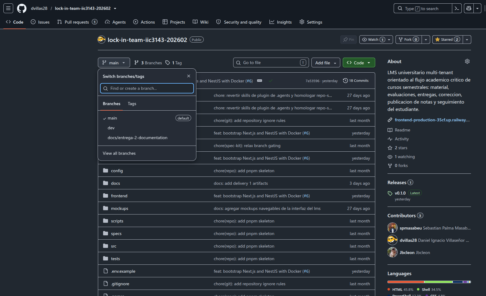

## 2. Hello World frontend conectado a backend

Frontend desplegado mostrando la respuesta real del backend (`GET /health`)

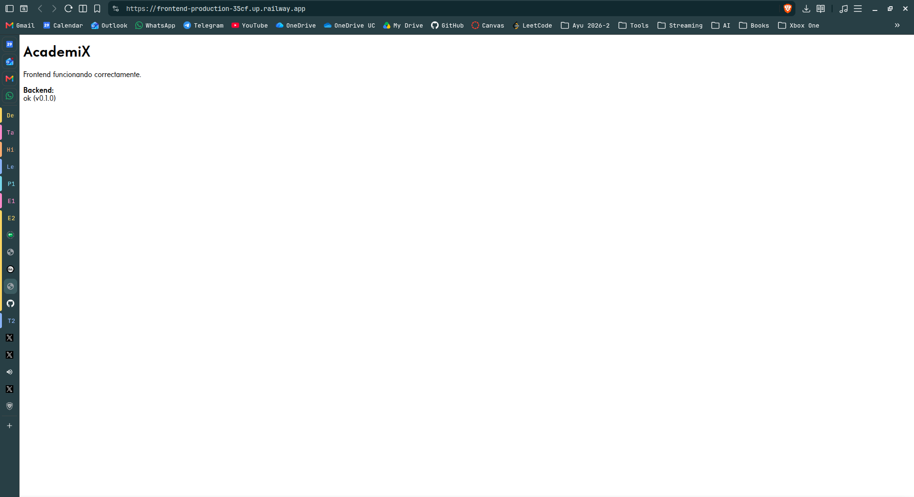

## 3. Continuous Integration

Workflow: [`.github/workflows/ci.yml`](../../../../.github/workflows/ci.yml).
Se ejecuta en PR hacia `main`/`dev` y en push a `main`.

| Stage        | Backend                          | Frontend                         |
| ------------ | -------------------------------- | -------------------------------- |
| install      | `pnpm install --frozen-lockfile` | `pnpm install --frozen-lockfile` |
| validate     | `pnpm lint`                      | `pnpm lint`                      |
| test / build | `pnpm test`                      | `pnpm build`                     |
| docker       | `docker build ./backend`         | `docker build ./frontend`        |

Ejecución exitosa del workflow CI (vista general de jobs):

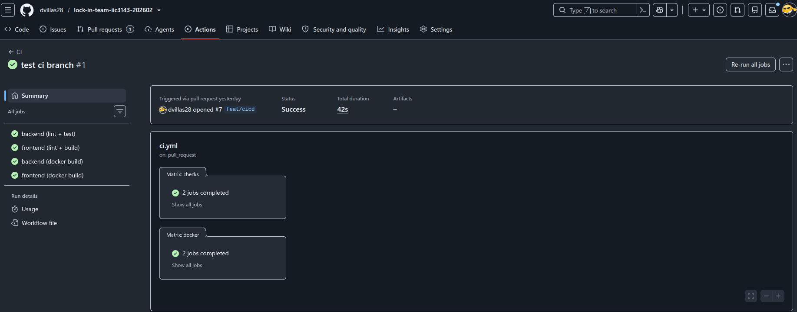

Detalle de los stages de un job:

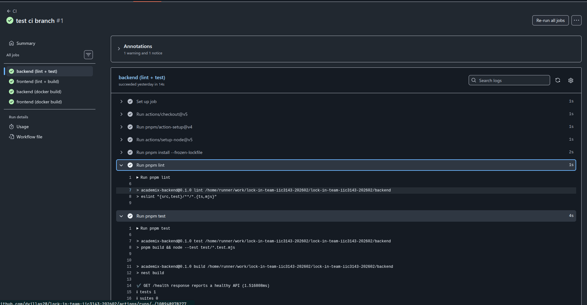

Checks de CI bloqueando/aprobando un Pull Request:

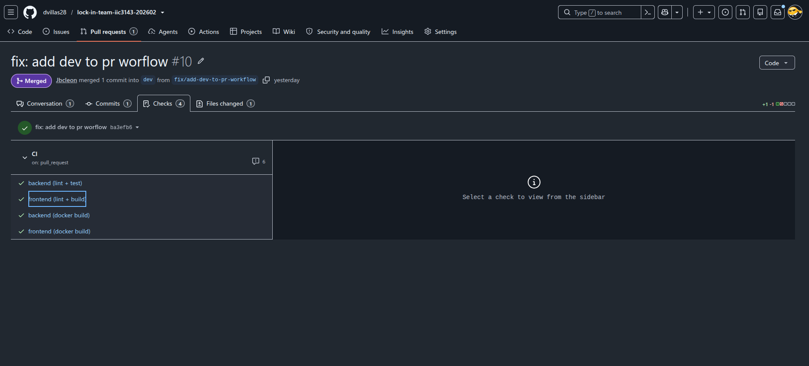

## 4. Continuous Deploy (Railway)

Cada servicio tiene su configuración versionada:
[`backend/railway.json`](../../../../backend/railway.json) y
[`frontend/railway.json`](../../../../frontend/railway.json). Railway despliega
automáticamente desde `main` después de que CI pasa ("Wait for CI"), usando el
`Dockerfile` de cada servicio y su healthcheck.

Proyecto Railway con ambos servicios desplegados:

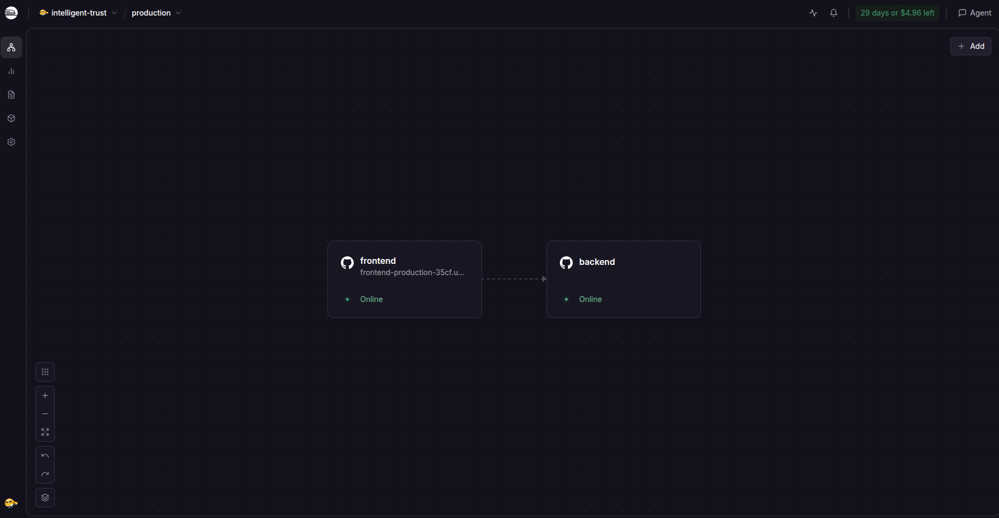

Historial de deploys automáticos del backend:

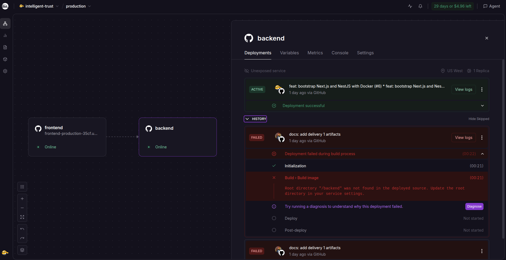

Historial de deploys automáticos del frontend:

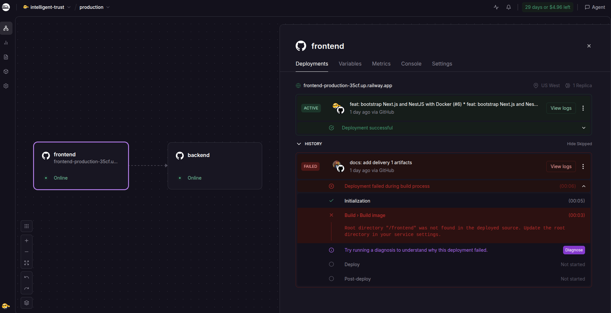

Log de build/deploy de un despliegue:

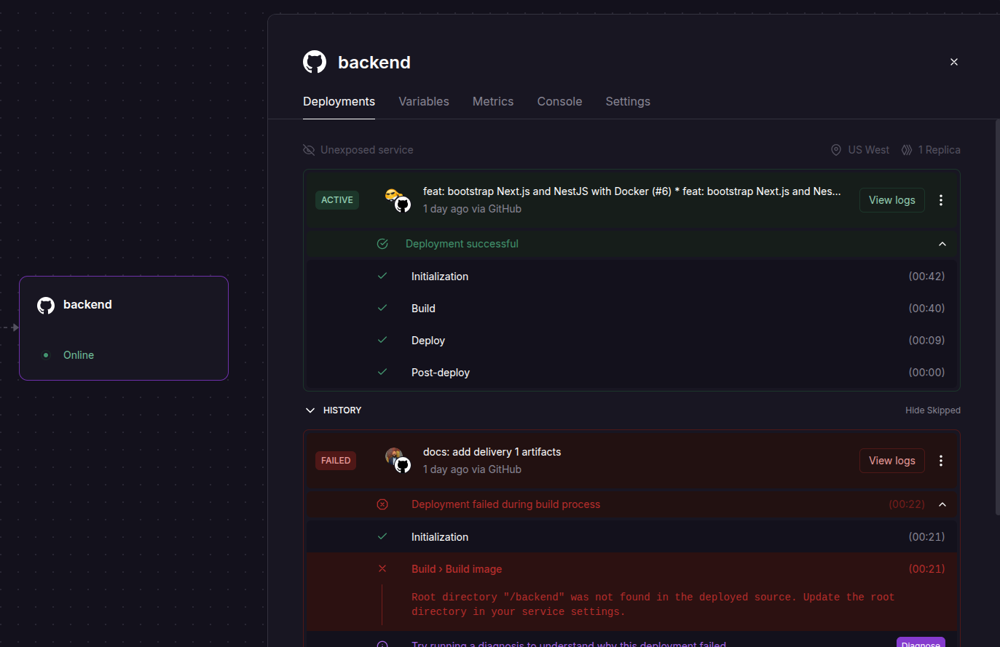

## 5. Tag + Release en GitHub

Workflow: [`.github/workflows/release.yml`](../../../../.github/workflows/release.yml).
Se dispara al empujar un tag SemVer `vMAJOR.MINOR.PATCH`, valida que el commit
esté en `main` y crea el release con notas generadas.

Ejecución exitosa del workflow Release:

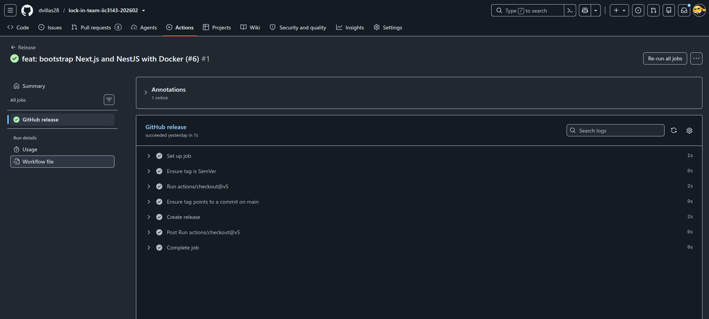

Release publicado en GitHub (`v0.1.0`):

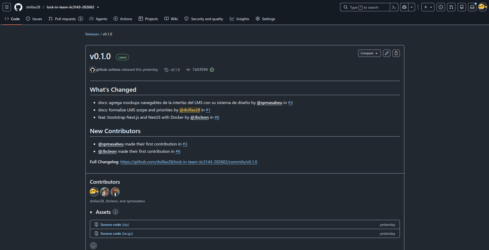

## Resumen

| Ítem del checklist             | Estado | Evidencia                                         |
| ------------------------------ | ------ | ------------------------------------------------- |
| Repositorio en GitHub          | OK     | [§1](#1-repositorio-en-github)                    |
| Hello World frontend + backend | OK     | [§2](#2-hello-world-frontend-conectado-a-backend) |
| CI backend y frontend          | OK     | [§3](#3-continuous-integration)                   |
| CD backend y frontend          | OK     | [§4](#4-continuous-deploy-railway)                |
| Tag + release                  | OK     | [§5](#5-tag--release-en-github)                   |
